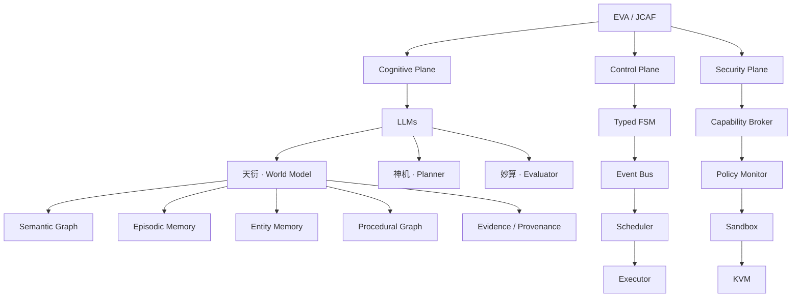

# EVA / JCAF 三平面架构对齐方案（待确认）

**日期：** 2026-10-06  
**状态：** 架构与迁移范围确认稿；确认后进入实现。  
**目标：** 以用户给出的三平面结构作为 EVA 的唯一目标架构，迁移有效能力，退出旧运行结构。

## 1. 本次架构决策

EVA / JCAF 统一划分为 Cognitive Plane、Control Plane、Security Plane。JCAF 在本方案中沿用用户图中的顶层名称；不额外假定其缩写含义或外部规范，也不保留一个与三平面并列的旧 Governance 系统。

三平面首先是代码和权限边界，初期可在一个应用中组合；该划分不要求拆成三个服务，也不要求拆成五个记忆数据库。契约、存储和可观测性是共享基础设施，不形成第四个业务平面。

**最终只有一条运行主链、一个事件消费所有者、一个执行授权入口；旧 FIFO / Minimal / MVSC 的运行模式选择退出。** 改造范围包括职责拆分、真实调用链替换、依赖约束、数据兼容和旧入口删除。旧核心不能长期藏在新模块名称下面继续运行。

## 2. 目标结构

下面的箭头表示架构归属与组件协作；实际事件执行有回路和跨平面调用，见第 4 节。



### 2.1 Cognitive Plane：理解、规划、评估

| 模块 | 职责与输出 | 权限边界 |
| --- | --- | --- |
| LLMs | 模型适配、结构化输出、调用预算与上下文处理，服务天衍、神机、妙算 | 模型响应属于候选数据；不能直接发放能力、变更 FSM 或调用有副作用的工具 |
| 天衍 / World Model | 形成可追溯的世界视图，提供一致的上下文快照、检索和候选增量 | 事实增量必须经过确定性校验和版本提交；图与缓存不能绕过事实权威直接写入 |
| 神机 / Planner | 将 Goal 与上下文转为有类型的 Plan / DAG / ActionProposal；表达依赖、前置条件、预期效果、预算和失败处理 | 输出计划，不拥有队列、状态终态或执行授权 |
| 妙算 / Evaluator | 执行前评估计划；执行后依据回执与独立证据验证目标，输出 Evaluation / VerificationResult | 模型评分不能替代安全授权；外部取证通过受控 Executor；动作返回成功不能单独证明业务目标达成 |

天衍的五项能力按以下语义划分：

| 能力 | 内容 | 本轮对齐要求 |
| --- | --- | --- |
| Semantic Graph | 概念、关系、命题和时间有效性 | 保留命题来源、有效时间、争议和撤回状态，区分陈述与已观察事实 |
| Episodic Memory | 请求、计划、动作、结果和反馈的经历记录 | 保留 Episode、父子 action、回执关联和历史不可改写语义 |
| Entity Memory | 人、项目、文件、任务等实体的稳定身份与属性 | 保留用户档案、SelfModel、Persona 的连续性及实体出处 |
| Procedural Graph | 技能、步骤依赖、前后条件、适用条件和经验 | 补建可查询的过程知识；记忆中的过程记录不能自行取得执行权限 |
| Evidence / Provenance | 观察、证据、引用、来源类别、时间和关联标识 | 引用原始动作回执和观察记录，区分用户陈述、助手推断、工具观察与未知 |

五项能力统一读取与关联接口，沿用或迁移有效持久化表。每类数据保留明确的唯一权威；不把动作回执复制成第二份事实。旧 S1–S4 等记忆层级可作为保留、索引和压缩策略，退出顶层架构角色。

### 2.2 Control Plane：确定执行过程

| 模块 | 职责 |
| --- | --- |
| Typed FSM | 统一管理 Request、Goal、Plan、Action 的有类型生命周期与合法迁移；运行状态也使用明确类型。请求完成、动作完成、世界提交、目标验证保持不同语义 |
| Event Bus | 提供事件身份、版本契约、admission 快照、持久化入站/出站和幂等投递边界 |
| Scheduler | 按优先级、依赖、截止时间、预算、并发和背压选择工作并交给 Executor；定时及主动任务进入同一主链，不另行 claim |
| Executor | 校验固定的动作意图，作为唯一执行 claim 所有者通过仓储原子 claim，获取安全授权，分发到受控后端，记录回执与异常；不自行创造权限 |

FSM 是生命周期迁移的唯一权威。GoalStore 等已有持久化实现可成为 FSM 的仓储，不能继续作为另一套状态规则。World revision / CAS 则负责世界事实提交，两者职责不同。

启动、停止、恢复由单一 composition / lifecycle 入口协调。停机等待真实 worker 生命周期结束再关闭存储。未知副作用仍记为 `outcome_unknown`，不自动重放已 claim 的动作。

### 2.3 Security Plane：决定能力并落实隔离

| 模块 | 职责 |
| --- | --- |
| Capability Broker | 根据主体、明确授权、动作类型、固定资源范围、期限与预算发放可验证能力；执行参数改变后不能沿用原授权 |
| Policy Monitor | 在输入接纳、调度及效果发生前执行策略检查；运行中监控撤销、超限与违规，向 Control Plane 发出停止/隔离事件 |
| Sandbox | 在实际执行端约束文件、进程、网络、环境和资源；只暴露获得授权的工具通道 |
| KVM | 作为目标部署的外层虚拟化隔离边界，承载受控运行环境；不承担认知和业务状态决策 |

Broker 与 Monitor 使用确定性规则，不能依赖 LLM 自行解释授予权限。Policy Monitor 可以拒绝或撤销能力；执行状态由 Control FSM 更新，避免出现两个状态所有者。

**KVM 是目标要求，当前并未验收。** 现有 EVA-VM 文档和 libvirt 模板可作为部署输入；真实后端、资源/网络约束、工具通道及故障恢复需要实现与实机验收。当前 Windows 开发工作区不等于已具备目标 KVM 环境，部署前需明确 Linux 宿主与 Guest 拓扑。需要隔离的动作在目标后端不可用时拒绝执行；不能静默降级为宿主 `subprocess`。开发模拟后端必须显式标明，不能被计入真实安全验收。

## 3. 建议代码布局

拟新增统一 `eva` 包。外部 API、UI、连接器保留接口角色，领域实现迁入三个平面。

```text
D:\EVA-ai\
├── app\                         API 与唯一 composition / lifecycle 入口
├── connectors\                  外部输入适配
├── ui\                          用户界面
├── eva\
│   ├── cognitive\
│   │   ├── llms\
│   │   ├── tianyan\
│   │   │   ├── world_model.py
│   │   │   ├── semantic_graph.py
│   │   │   ├── episodic_memory.py
│   │   │   ├── entity_memory.py
│   │   │   ├── procedural_graph.py
│   │   │   └── evidence.py
│   │   ├── shenji\planner.py
│   │   └── miaosuan\evaluator.py
│   ├── control\
│   │   ├── fsm\
│   │   ├── event_bus\
│   │   ├── scheduler\
│   │   └── executor\
│   ├── security\
│   │   ├── capability_broker\
│   │   ├── policy_monitor\
│   │   ├── sandbox\
│   │   └── backends\kvm\
│   ├── contracts\               统一 Event / Goal / Plan / Action / Evidence 契约
│   ├── storage\                 仓储、迁移、版本与事务适配
│   └── observability\           日志、指标、审计和关联追踪
├── infra\                       目标部署配置
└── tests\                       职责边界、故障、数据迁移与功能验证
```

以上是待确认布局，不代表这些文件已经实现。跨平面协作使用有类型契约和注入端口；Cognitive 不直接导入底层工具执行器，三个领域平面不导入 FastAPI 或应用配置。

## 4. 唯一执行闭环

```text
外部输入 / 定时事件
→ admission 与安全策略检查
→ Event Bus
→ Typed FSM 接纳与任务状态迁移
→ 天衍：固定上下文、世界版本、记忆与证据引用
→ 神机：生成有类型计划与动作候选
→ 妙算：执行前评估
→ Control：校验计划，持久化 ActionIntent
→ Scheduler：选择工作并交给 Executor
→ Executor：原子 claim，请求 Capability Broker 授权，接受 Policy Monitor 再检查
→ 受控后端：在 Sandbox / KVM 边界内执行
→ Control：记录 ActionReceipt / outcome_unknown，发布结果事件
→ 妙算：独立取证与目标验证
→ Control FSM：合法状态迁移；天衍：校验并提交 WorldDelta
→ 请求终态回执、可追溯记忆与用户反馈
```

执行记录、目标验证和世界提交保留明确事务边界；该闭环不宣称跨外部副作用、所有存储与世界状态的全链原子提交。采用持久化意图、版本围栏、幂等回执与恢复规则维持一致性。

关键约束：

1. 用户 P0 指令优先级保留；Scheduler 处理优先级，Security Plane 校验动作实际获得的资源权限。
2. LLM 输出和旧记忆内容都不能直接触发工具效果；所有效果经过统一 Executor 与安全入口。查询已有证据使用注入的只读仓储；新增文件或网络观察，包括只读采样，也须提交 ObservationProposal，经过同一 Executor、授权与受控后端，妙算不能直接访问宿主文件或网络取证。
3. 动作参数、资源范围、上下文版本和证据关联由服务端固定，不能接受模型伪造的 action ID、授权或“已完成”证明。
4. receipt、业务目标 verification、World commit 分别记录。某一环节失败或版本冲突不抹去已发生的效果，也不隐式重做动作。
5. 只恢复已证明未 claim 且仍有效的请求；已 claim 且结果未知的请求进入对账/观察流程。
6. 只读图、追踪和回执查询不能推进状态、执行验证或补发动作。
7. 迟到回执和新观察按原契约追加关联，不改写已封存 Episode，也不直接把工具返回状态升格为目标达成。

## 5. 旧实现迁移与最终删除范围

表内旧路径用于定位源代码。迁移时以实际依赖清单决定拆分与删除，不能按整个 `packages` 目录粗删。

| 旧模块/结构 | 迁移去向 | 最终处置 |
| --- | --- | --- |
| `D:\EVA-ai\core\event_processor.py` | 上下文入天衍，规划入神机，评估入妙算，状态/回执入 Control，策略入 Security | 删除旧总控入口；新 Scheduler 不再调用它 |
| `D:\EVA-ai\core\cognition_loop.py`；`D:\EVA-ai\packages\cognition\` 中运行循环；Minimal Brain / MVSC 运行桥 | Control 的唯一消费与 lifecycle；可用的注意力算法作为候选调度策略 | 删除并列 consumer、旧 pipeline composition 与模式切换配置 |
| `D:\EVA-ai\agent_os\` | 模型/Agent 适配入 Cognitive，任务分发入 Control，工具权限入 Security | 移除 AgentOS 独立架构与旧 orchestrator/router 主链 |
| `D:\EVA-ai\core\planner.py`；`D:\EVA-ai\packages\agentos\planner_dag.py` | 神机；复用路由与依赖图部件，补建有类型规划 | 删除重复规划入口，不把现有任务分类器当作完整 Planner |
| `D:\EVA-ai\core\prediction.py`；`D:\EVA-ai\core\response_review.py`；旧 Verifier / 文件 checker | 妙算的独立评估与验证策略；确定性 checker 保留 | 合并重复评估接口，结果验证与语言输出审查保留不同语义 |
| `D:\EVA-ai\core\policy_engine.py` | 运行状态、优先级入 Control；Token、权限与策略入 Security | 删除混合职责的 PolicyEngine 主入口 |
| `D:\EVA-ai\core\executor.py`；`D:\EVA-ai\runtime\` 的 worker 与 scheduler | Control Executor / Scheduler；工具效果端入受控执行后端 | 保留有效实现后删除重复调度、执行和 worker 生命周期所有者 |
| `D:\EVA-ai\world\`；`D:\EVA-ai\memory\`；`D:\EVA-ai\persona\` | 天衍五项能力与共享 storage | 迁移实体、记忆、人格和证据逻辑；旧顶层子系统角色退出 |
| `D:\EVA-ai\packages\kernel\` 中 durable request、Episode、inbox/outbox、action store | Control 与统一 storage / contracts | 保留持久化与恢复语义；删除独立 Kernel 运行主链 |
| `D:\EVA-ai\packages\governance\`；`D:\EVA-ai\packages\agentos\sandbox.py` | Security 的授权/策略/隔离实现 | 复用可用部件，补建真正边界；删除双套治理与 Sandbox 入口 |
| `C:\Users\origi\.codex\worktrees\framework-refactor-v1\EVA-ai\state\`、`execution\`、`evidence\`、`goals\` | 统一 contracts / storage 及对应平面 | 保留已验收契约与权威，迁移而非另建第二份权威 |
| `D:\EVA-ai\packages\mvsc_lab\` 的研究能力 | 迁移可用算法；其余实验资料进入历史/研究归档 | 生产架构与 bootstrap 不再依赖研究运行时 |
| 旧四系统、旧稳定运行时、Minimal/MVSC 的架构文档与入口说明 | 新 canonical 架构、边界与开发状态文档 | 旧说明移入历史归档并标注被替代，退出当前规范 |

旧结构最终退出的验收标准：生产 import / composition / 配置 / API / UI 均不再选择旧运行链；旧模块没有生产依赖；临时源码兼容 re-export 与桥接层移除。历史数据库和必要的对外 API 兼容可以保留，其实现由新架构负责，不保留双套运行时。

以下资产迁移保留：用户文件、真实数据库、记忆/人格/世界历史、快照、Goal、Action、Episode、Evidence、审计及测试所证明的故障语义。删除范围指旧运行结构及重复代码；不包含清空这些数据。

## 6. 当前开发状态与能力差距

| 项目 | 已核实情况 | 对齐工作 |
| --- | --- | --- |
| 主工作区 | `D:\EVA-ai` 存在较多未提交变更；ACT-04 上下文绑定与 EVD-02 时间命题契约等更新需要纳入 | 先做变更清单与差异归并，避免以旧基线覆盖较新实现 |
| 已验收增量重构 | 工作树 `C:\Users\origi\.codex\worktrees\framework-refactor-v1\EVA-ai` 的已验收提交为 `ce4e3e8`，覆盖 R0–R5 | 作为可复用基础；不等于目标三平面已经实现 |
| R4–R5 既有验证 | 记录为 Python 2040 通过、1 跳过；JS 386 通过；架构、Ruff、资产检查通过 | 这些是原提交的离线验证结果，不是本次目标架构验收 |
| R6 草稿 | 同一工作树有未验收修改；尚未形成可宣称完成的阶段 | 独立保留、核对并按新目标吸收；不能把当前工作树整体视为已验收可启动版本 |
| 天衍 | 已有世界图、分层记忆、Entity、Episode、Provenance、版本提交部件 | 整合统一接口，补全语义/程序图及事实与视图边界 |
| 神机 | 现有稳定 Planner 主要是任务路由；实验 DAG 是局部实现 | 补建类型计划、依赖、前后条件与失败处理，接入唯一 Control 主链 |
| 妙算 | 已有响应审查、预测反馈和确定性文件检查 | 建立独立 Evaluator 与目标验证契约；不能用旧 Verifier 返回值替代事实证明 |
| Typed FSM | 已有运行状态机与分散的 Request / Action / Goal 状态 | 收敛类型、迁移规则、仓储所有者及事件关联 |
| Security / KVM | 已有 Token/权限部件、弱 Sandbox 与虚拟机部署蓝图 | 补建 Capability Broker、Policy Monitor、真实 Sandbox 与 KVM 后端验收 |

ACT-04 的实际上下文引用/哈希与 EVD-02 的时间命题状态必须迁入新体系。已有 World revision / CAS、first-terminal-wins、固定意图、未知结果禁止自动重放、Episode/outbox 幂等通知和只读查询语义继续作为约束。

## 7. 确认后的执行顺序

新的三平面目标替代原 R6–R8 的架构安排；R0–R5 已完成的有效成果纳入迁移基础。阶段编号用于本方案，避免与原编号混用。

| 阶段 | 工作 | 可验收产物 |
| --- | --- | --- |
| A0 基线与迁移清单 | 对照主工作区、已验收提交和 R6 草稿，保存变更与数据迁移边界 | 可复现基线、逐模块迁移/删除清单、历史数据兼容方案 |
| A1 边界与契约 | 建立三平面包、有类型 FSM、统一契约与执行授权端口 | 架构依赖检查；非法迁移、参数变化、无授权效果被拒绝 |
| A2 认知模块 | 天衍五项接口与权威衔接，神机类型计划，妙算独立评估/取证 | 可跑通的认知输入输出；来源、计划依赖、证据验证测试 |
| A3 单一运行主链 | admission / EventBus / FSM / Scheduler / Executor / recovery 统一接线 | 默认 API、主动任务、重启与停机均运行同一链路；无并列 consumer |
| A4 隔离后端 | 落实 Broker / Monitor / Sandbox，接入目标 KVM 环境 | 真实环境的资源、文件、网络、撤权、崩溃和审计验收；缺失后端不降级执行 |
| A5 旧结构退出 | 删除已迁移旧入口、桥接、模式配置、重复实现和临时 re-export；更新 canonical 文档 | 生产无旧架构依赖；全量回归、迁移/恢复验证和最终开发状态报告 |

代码在隔离开发工作树实施。真实服务部署与重启需等实现、离线验证及目标环境验收条件齐备后安排。KVM 的环境信息在 A4 前落实；本次不把一个接口或模板当作完整隔离交付。

## 8. 最终验收条件

1. 架构与依赖只体现 Cognitive / Control / Security 三平面，生产主链不存在旧 EventProcessor 总控或旧 consumer 模式。
2. 天衍提供五项可用能力与可追溯上下文；神机产生可校验计划；妙算完成独立的前评估与后验证。
3. 所有受控效果通过同一 Executor、安全授权和隔离后端；Cognitive、API 和 Agent 不能旁路执行。
4. 权限撤销、越界资源、过期能力、并发冲突、未知效果、恢复、背压和停机行为有验证证据。
5. 数据迁移保留身份、出处、历史与关联；迁移前后可比较数量、引用和读取结果；失败具备可恢复路径。
6. 数据库版本/CAS、回执、业务目标、Episode/outbox 和 API/UI 行为通过适当回归；旧架构测试替换为验证新职责边界的测试。
7. KVM / Sandbox 经真实执行环境验收；模拟运行或字符串筛查不能满足本条。
8. 新 architecture、architecture-boundaries、开发状态及迁移报告与实现一致；旧说明只作为历史资料。

## 9. 本次待确认范围

建议一次确认以下范围：

- 采用用户图中的 EVA / JCAF 三平面作为唯一目标架构，并采用第 2–4 节的职责、权限与运行闭环。
- 按第 5 节迁移有效实现与历史数据，最终删除旧运行入口、并列模式、重复治理/执行链和临时源码桥接。
- 按第 7–8 节实施与验收；神机、妙算及真实隔离能力需要补建，KVM 不以现有文档或接口占位视为完成。

**本次交付是确认稿。确认前仅整理方案，尚未按本方案替换或删除运行代码。**

## 10. 核对依据

- [当前稳定运行时架构](D:/EVA-ai/docs/architecture.md)
- [当前职责边界](D:/EVA-ai/docs/architecture-boundaries.md)
- [EVA-VM 部署设计](D:/EVA-ai/docs/eva-vm-architecture.md)
- [ACT-04 实际动作上下文绑定](D:/EVA-ai/docs/action-context-bindings-act04.md)
- [EVD-02 时间命题契约](D:/EVA-ai/docs/temporal-assertions-evd02.md)
- [R4–R5 已验收增量说明](C:/Users/origi/.codex/worktrees/framework-refactor-v1/EVA-ai/docs/refactor-v1-r4-r5.md)
- [R4–R5 离线检查记录](C:/Users/origi/.codex/worktrees/framework-refactor-v1/EVA-ai/artifacts/refactor-v1/r4-r5/report.json)

上述文件描述当前或历史状态；本方案确认并完成迁移后，新 canonical 文档再替代旧规范。
