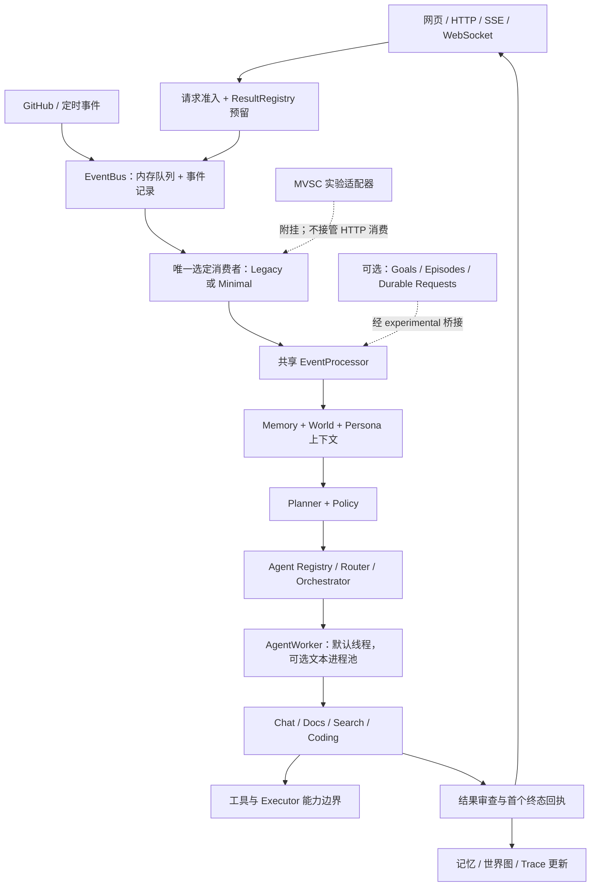

# EVA 架构复盘与开发现状（2026-10-01）

复盘对象：当前 `D:\EVA-ai` 工作区。依据：源码、测试、Git 状态、本轮隔离回归及现有交付文档。本文是日期快照；运行契约仍以代码、测试和 OpenAPI 为准。

同日后续增量：[ACT-03](unclaimed-request-recovery-act03.md) 已实现可证明未领取请求的
恢复调度，保留原期限、重查当前策略，并协调 Minimal 快照去重与待处理业务目标。
下文关于该能力待开发、Git 数量和回归计数保留为复盘时的历史基线；最新范围与验证
以 ACT-03 记录为准。开关仍默认关闭，已领取/未知请求不自动重新执行。

## 1. 总体判断

EVA 已形成可以持续演进的**单实例、事件驱动的个人助手运行基础**：从请求接纳、认知处理、Agent 执行到记忆、世界图和客户端回执，主链路完整。开发重心已经从增加模块推进到恢复、来源、状态版本、行动记录和目标验证。

当前最需要收敛的是交付基线和能力口径。大量关键增量仍未进入 Git；默认运行链路与实验账本并存；产品发布验收还有公网登录交互、手机实机、离线交付和运行恢复等缺口。下一阶段宜先建立可复现的版本与验证矩阵，再逐步启用已经实现的耐久能力。

| 维度 | 当前结论 | 判断边界 |
| --- | --- | --- |
| 基础助手链路 | 已实现，具备组件与 HTTP 集成回归 | 单 Core、共享个人数据；不支持透明多实例扩容 |
| 架构边界 | 已有组合根、分组容器、共享处理器和架构测试 | 仍有兼容属性、大职责模块及直接 I/O 路径 |
| 可靠性 | 进程内回执完善；耐久请求、处理记录、目标已有可选接线 | 默认关闭；各账本不构成全系统事务 |
| 认知原型 | Minimal 有独立周期、注意力与有限工作空间；MVSC 有实验内核 | 不足以证明通用目标达成、模拟或经验证的学习 |
| 开发质量 | 本轮 Python、JavaScript、Ruff 和生成资产检查通过 | 实机、真实模型质量、长期压力及生产切换不在本轮范围 |
| 发布准备 | 有部署资产、运行手册和历史上线记录 | 当前 Git HEAD 不能还原完整工作区；最终产品门槛未全部闭合 |

不能给出一个可信的“项目完成百分比”：运行基础、研究目标和产品验收使用不同完成标准，应分别管理。

## 2. 当前实际架构

图示概括职责关系，各项副作用并非一个原子事务。请求入口先预留回执，再发布事件；处理器执行前领取请求，避免已过期、被拒绝或领取失败的请求继续产生副作用。客户端轮询、同步等待、SSE 和 WebSocket 围绕同一权威终态交付。

关键入口：[main](../app/main.py)、[bootstrap](../app/bootstrap.py)、[composition](../app/composition.py)、[container](../app/container.py)、[EventProcessor](../core/event_processor.py)、[RuntimeController](../runtime/controller.py)。

### 2.1 生命周期与依赖方向

- `app/main.py` 管 FastAPI lifespan；`bootstrap.py` 管构建、资源移交、启动和关闭顺序；`composition.py` 创建组件。
- `RuntimeController` 管唯一选定消费者及依赖生命周期；`EventProcessor` 管一次事件的业务处理，不拥有消费线程。
- 关闭先停止准入与生产者，再等待真实 worker 结束，随后保存状态、关闭账本和存储。关闭失败保留依赖并支持重试。
- 稳定领域模块不导入应用容器或 FastAPI；`packages/*` 通过 `app/experimental.py` 进入主线。规则由 [架构测试](../tests/test_architecture.py) 约束。
- FastAPI lifespan 当前只调用一次 `shutdown_system`；组件的可重试关闭契约，还需要部署退出流程配合。

这次重构最有价值的结果，是消费者、事件处理服务和 worker 生命周期已有明确边界。后续替换调度器可以复用处理链路，无须再维护一套网页业务流程。

### 2.2 三种运行配置

| 配置 | 实际 HTTP 消费者 | 处理服务 | 已实现范围 |
| --- | --- | --- | --- |
| 默认 | `core.cognition_loop.CognitionLoop` | 同一个 `EventProcessor` | FIFO 事件处理、回执、工具与记忆链路 |
| `EVA_ENABLE_MINIMAL_BRAIN=true` | `MinimalBrainKernel` | 同一个 `EventProcessor` | 独立周期节点、注意力排序、有限工作空间；legacy 消费线程不启动 |
| `EVA_ENABLE_MVSC_PIPELINE=true` | 仍是 legacy | 同一个 `EventProcessor` | 装配 EventStore、Adapter、AdaptedLoop 等；实验循环需显式驱动 |

Minimal 与 MVSC 互斥。判断正在运行哪条链路，应读取 `/api/runtime` 的实际消费者与生命周期观察，不能只读取开关。

代码默认值为 SQLite、1 个 cognition worker、4 个 Agent 线程；Docker Compose 将 cognition worker 默认设为 2，部署配置与代码默认值需分别记录。本轮未读取私有环境文件，也未据默认值推断线上开关。参见 [Settings](../app/config.py) 与 [BASE-02](runtime-baseline-base02.md)。

## 3. 模块与产品能力

| 模块 | 职责 | 当前状态与边界 |
| --- | --- | --- |
| `app/` | API、配置、组合根、生命周期、实验桥接 | 已按路由拆分；容器分为 memory/persona/world/agents/runtime/integrations，仍保留旧扁平属性 |
| `event/` | 版本事件信封、编码、接纳快照、总线 | v1 契约、旧格式显式适配、来源 ID 已实现；主总线仍在内存 |
| `core/` | 处理、上下文、规划、策略、工具、预测与主动决策 | 稳定业务主线；预测与自我反馈主要是启发式指标 |
| `agent_os/`、`agents/` | 注册、路由、编排与四类 Agent | Chat 可调用受控工具；Search 是本地文本检索，Coding 是代码结构/摘要分析，Docs 是文本摘要 |
| `runtime/` | worker、调度、回执、认证、健康、诊断、消息 | 线程后端默认；进程后端支持 chat/docs 文本任务，可终止替换，暂无 OS 资源沙箱 |
| `memory/` | 结构化/分层记忆、检索、治理、来源、处理和工具记录 | S1–S5 已实现；支持来源标签与显式 S3 授权；多投影写入仍有一致性缺口 |
| `world/` | 当前实体关系、快照、恢复与离线恢复副本 | 快照和 S4 按实体 ID/关系三元组合并，支持分页与来源保留 |
| `persona/` | 人格约束、关系、profile、self-model | 数据与行为约束已实现；稳定度更新不等于自主学习已验收 |
| `connectors/` | GitHub 输入、Obsidian 镜像 | GitHub 已接线但游标/去重不耐久；Obsidian 为单向 Markdown 镜像 |
| `packages/` | Minimal、MVSC、状态/行动/目标/账本契约 | 多项已有真实实现与测试；进入网页主线的范围取决于独立开关 |
| `ui/web/` | 聊天、记忆图谱、目标视图、设置、品牌与主题 | 原生 JS + Jinja 模板；图谱交互、主题、请求恢复和品牌生成有专项回归 |
| `scripts/`、`infra/` | 预检、基线、部署、恢复、交付 | 工具已具备；VM 配置存在不代表 Windows 源站已运行在 VM 内 |

### 3.1 需要保持清晰的产品口径

1. 默认对话工具包含文件检索/读取/列目录、记忆检索和受授权的文档导入。对话中的代码、通用网络与固定行情工具默认不注册。Executor 管理 API 是另一路受令牌和边界检查控制的入口，不能把对话开关解释为系统完全禁止执行。
2. LLM 有 Mock、OpenAI、Claude、DeepSeek 适配。Chat 当前用结构化文本表达工具请求，最多五轮；动态 Agent 注册是受约束的模型代理包装，不是任意代码插件加载。
3. SSE/stream 路径交付经审查的最终内容；原始模型草稿不会直接对外发布。断开流连接不等于取消已接纳任务，恢复应查询原任务。
4. `remember=false` 约束显式长期保留授权，**不等于不持久化对话**。普通请求仍可能留下事件、治理记录、episodic memory 和 trace。
5. 上下文使用 S2/S3 回忆前十项；S3 在 embedding/FAISS 可用且索引非空时走混合检索，否则退化为 FTS5。向量基础设施和召回效果应分别验收。
6. 来源标签区分用户陈述、助手推断、工具观察、模拟与未知；回复抽取的世界实体仍是助手推断。`contract_checked` 是声明与回执的机械核对，`fact_verified=false` 的边界仍有效。
7. 固定 FRED 行情工具仅覆盖美股三大指数每日收盘快照，默认关闭；不覆盖盘中报价、个股、天气或新闻。其历史启用记录见 [行情文档](us-market-snapshot.md)，本轮未发送真实行情请求。
8. Access 身份保护的是同一份个人实例。当前上下文的 `user_id` 未参与记忆隔离，不具备多租户数据边界。

## 4. 持久化保证梳理

当前系统有多种持久化机制，必须按对象和事务边界理解。

| 对象/能力 | 默认行为 | 可选增量 | 尚未保证的部分 |
| --- | --- | --- | --- |
| 事件队列 | 内存 EventBus；S5 记录为 best effort | EVT-02 提供 SQLite inbox/outbox 和可选 adapter | 默认 HTTP 全链路未切为耐久 broker；外部动作不具通用 exactly-once |
| 请求回执 | ResultRegistry 在进程内预留、领取、保留首个终态 | ACT-02 接入真实 legacy/Minimal 三类聊天入口，保存完整请求/回执 | 默认关闭；重启不自动执行原请求 |
| 请求恢复 | 默认重启丢失进程内结果 | 未领取请求封存未执行/过期；已领取但缺少可信终态的请求封存 unknown | 审计摘要不能补造原始正文；超时也不能证明外部执行停止 |
| 状态与行动 | live World/Memory 由处理链路分别更新 | STA-01/ACT-01 有 revision、StateDelta、状态/事件/行动意图原子提交 | 默认世界模型未统一迁入该状态仓库；ACT-02 账本是请求派发状态 |
| 处理与工具记录 | 原有事件/trace | EPI-01 写执行前草稿、首个终态封存、线程内工具意图/返回收据；目标通知 outbox 可补送 | 默认关闭；直接 Agent I/O、子线程内部和跨进程工具未全部记录 |
| 业务目标 | 普通聊天处理回执 | GOL-01 SQLite 目标、登记/取消、版本保护、显式文件哈希验证和证据图谱 | 默认关闭；处理成功只到待验证，文件字节匹配不证明代码质量 |
| 未知副作用对账 | 不自动推断成功 | REC-01 独立采样固定文件写入目标，增补历史观察 | 不改写原 unknown 收据，不自动推进目标，不授权重试；远程对账待接入 |
| 世界图恢复 | 快照 + S4 合并，按时间/来源规则去重 | RST-01/02 提供候选、回滚副本与成本记录 | 世界、记忆、外部副作用和回执不在同一事务内 |

保留当前的“未知结果”语义是合理的：它防止将断线、超时、进程退出误报为动作未发生或目标已完成。后续恢复调度应只自动处理可以证明未领取的请求，并重新检查期限、授权和去重；已发生或可能发生的外部动作应先对账。

基础存储有 PostgreSQL adapter，但图谱/Obsidian 和 Goals/Episodes/Durable Requests 依赖 SQLite。换数据库不等于获得全功能后端兼容或多实例能力。

## 5. 开发状态与交付轨迹

### 5.1 Git 与工作区基线

本轮开始时的快照：

| 项目 | 结果 |
| --- | --- |
| 分支 / HEAD | `master` / `bf91c81` |
| 最后提交 | 2026-08-03，worker IPC 测试与进程入口 |
| 提交 / 标签 | 123 个提交，无 Git tag |
| 已跟踪改动 | 90 个文件；+4,974 / -2,570 行，仅计算 tracked diff |
| 未跟踪 | 170 个折叠条目，展开为 466 个文件 |
| 测试组织 | 116 个 Python 测试文件：根目录 88、MVSC 14、Minimal 14；18 个 JavaScript 测试文件 |

未跟踪文件中包含 249 个 artifacts、71 个测试文件、38 个文档、30 个 UI 文件、22 个 packages 文件。进程后端、ACT-02 请求账本、v3 路线图等关键交付仍未跟踪；不能用 HEAD 或一次干净 clone 复现文档描述的全部能力。

上述数字是新增本报告与证据前的状态。不能把“未提交”解释为“功能没开发”，也不能把工作区测试通过解释为已有可部署 Git 发布版本。

### 5.2 工作流状态表

| 工作流 | 当前代码状态 | 下一道门槛 |
| --- | --- | --- |
| 组合根与运行时重构 v0.2 | 已实现，稳定主线共享处理器/生命周期 | 收敛兼容属性，明确关闭失败的部署处理 |
| WRK-01/02 | IPC 与可替换文本进程池已实现 | WRK-03/04 的资源限制、后代管理、授权工具代理及跨平台验证 |
| RST-01/02、EVD-01 | 世界图幂等恢复、分页/投影、字段来源与离线副本已实现 | 长期运行规模与真实恢复演练 |
| EVT-00、BASE-02、EVT-01 | 进程内请求终态、实际模式观察、版本信封与固定 Mock 基线已实现 | 持续压力、真实模型/网络传输基线 |
| STA-01、ACT-01 | 状态 revision 与状态/行动事务已有实验实现 | 明确统一状态权威与生产接线范围 |
| EVT-02 | 耐久 inbox/outbox 参考实现及可选 adapter 已实现 | 默认 HTTP 生产队列接线、游标与动作幂等方案 |
| EVD-02 | 时间化断言、撤销/替代/有效期契约已实现 | 实体/记忆历史表迁移、API/UI 接入 |
| EPI-01、REC-01、ACT-02 | 可选处理器/HTTP 接线和崩溃窗口回归已实现 | 真实部署切换、远程副作用对账、全部执行入口覆盖 |
| GOL-01 | 可选目标持久化、HTTP/回执、文件验证、图谱与登记界面已实现 | 更广泛业务 verifier、生产验证与目标执行闭环 |
| OBS-01 | 有界记忆图谱、单向 Obsidian 镜像、导出和局部探索已实现 | 公网登录后和手机实机交互；双向同步不在已交付范围 |
| Chat 模式/审查/行情 | 正常/深度模式、有限格式修复、固定每日行情与失败停止已实现 | 真实模型质量、长会话与成本评价 |
| UI/Logo/Theme | 共享状态与主题、异常恢复、品牌版本/指纹、本地交付检查已实现 | 原生保存/直接离线、前台性能、真实缩放/辅助技术 |
| 信念/模拟/学习 | 有来源、预测、状态调制等基础与研究输入 | 历史断言接线、替代解释、可验证未来状态、留出评价及回滚闭环 |

### 5.3 文档整理结论

现有文档已经区分 Canonical、Experimental、Research，且大多数交付声明主动说明边界，值得保留。但增量通过不断追加执行记录积累，首页状态容易过时：

- v3 顶部仍写下一批 STA-01，后部已记录 ACT-02；F01–F06 是修复前基线，不能作为全部问题仍未修复的清单。
- `DEVELOPMENT.md` 仍将进程后端称为未来工作、将未来计划指向 v2，并只用 MVSC 概括 `packages/`；与当前 Minimal/目标/账本接线不一致。
- Compose 的“PostgreSQL for multi-instance”注释与单实例约束不一致。
- “架构可靠性 P0 已完成”与“公网产品 P0 未全部完成”指不同验收范围，应在入口明确命名。
- 历史测试数量、UI 包文件数和旧 PID 应继续保留为带日期记录；当前状态应由统一简表指向最终版本证据。

本报告提供一个集中入口；没有覆盖原有历史记录，也没有将建议自动标为已完成。

## 6. 具体架构债与处理建议

下面的 P0/P1/P2 是本次复盘的处理顺序，不覆盖其他专项的同名分级。静态发现表示源码可确认的缺口，不代表已复现线上故障。

| 顺序 | 问题与证据 | 影响与验收方向 |
| --- | --- | --- |
| P0 | 核心增量没有 Git 发布基线；当前源站与开发共享目录的部署资产仍存在。证据：Git 快照、`main.py:55` 静态目录和 UI 模板路径 | 无法由 commit 复现完整系统；模板/JS 可先变，内存中的 Python 后端仍旧。建立版本化发布目录与前后端版本观察，验证可回滚 |
| P1 | 默认线程池只有执行槽位限制，`agent_worker.py:125` 直接 submit，未采用进程池同等的显式队列容量；线程超时不能强制终止 | 等待结束与实际资源释放分离。验证持续阻塞时的准入、排队、辅助任务预算和关闭失败行为 |
| P1 | `EventProcessor` 明确共享状态保留 last-write-wins；增加 cognition workers 仍共享世界/记忆/自我模型 | 多线程能增加处理并发，不能据此保证认知状态顺序。建立会话/状态版本提交规则并验证旧结果拒绝 |
| P1 | `memory_governor.py:161` 先 upsert，随后写 tiers；异常在 `:176` 被吞，`tier_ids` 在原 upsert 后才赋值 | 治理记录与检索投影可能漂移。记录失败状态与可重建关联，注入投影写失败后验证补齐和幂等 |
| P1 | GitHub poller 只取 open 首十条、内存 checkpoint 重启设为 now；webhook 去重集合进程内且满后清空 | 宕机补齐、分页与可靠去重未保证。持久游标/来源 ID，验证超过一页、重复投递和宕机窗口 |
| P1 | `deploy.yml:24` 只跑 Ubuntu/Python pytest + Docker build，缺少 Ruff、JS、资产与 Windows 门禁 | 本地检查未形成完整自动交付约束。将现有命令接入矩阵并保存版本/证据 |
| P1 | `preflight.py:113` 执行 `PRAGMA integrity_check` 后不读取结果即报成功（静态发现） | 检查语句执行成功不足以确认返回值为 `ok`。要求实际结果匹配，并用正常/异常返回回归验证 |
| P2 | `llm_timeout_sec` 设置/展示默认 60；adapter 读取 `EVA_LLM_TIMEOUT` 默认 30。`embedding_alpha/rerank_k` 未从 Settings 接到默认检索 | 用户配置和实际行为可能不同。统一变量与有效配置观察，验证修改参数确实改变运行路径 |
| P2 | Search/Coding 直接读取本地文件，部分 Agent I/O 不经统一 Executor/工具收据 | 权限、审计与能力统计存在不同口径。注入统一文件服务，保留当前行为并核对收据覆盖 |
| P2 | ChatAgent 1,072 行、Executor 973、ToolRegistry 961、EventProcessor 871；扁平容器兼容层仍在 | 变更集中到大模块。沿已存在的职责边界拆分，而不是再引入一套运行框架 |
| P2 | 完整 PNG 校验依赖 Pillow，requirements 未声明；Node 版本未进入工具/CI 清单 | 干净环境可能无法重复 UI 交付检查。固定开发依赖并验证全新环境 |

高权限进程沙箱、跨实例协调和通用目标规划还有显著工作量，但应分别建立明确需求与支持矩阵。当前个人单实例的定位可以继续保留，不需要为了架构图完整而同时重写所有存储。

## 7. 本轮实际验证与限制

| 检查 | 本轮结果 | 证据 |
| --- | --- | --- |
| 全量 Python | **1,897 passed，1 skipped，196.98 秒** | [原始输出](../artifacts/architecture-review-2026-10-01/pytest.txt)、[JUnit](../artifacts/architecture-review-2026-10-01/pytest.xml) |
| 全量 JavaScript | **386 passed，0 failed** | `node --test tests/js/*.cjs`；计数记录在复盘证据清单 |
| 全仓 Ruff | **通过** | `python -m ruff check . --output-format concise` |
| 生成品牌资产一致性 | **通过** | `node scripts/build_brand_assets.cjs --check` |

Python 使用 3.11.9，pytest 9.1.1；Node 为 24.19.0，Ruff 为 0.7.4。当前安装的 pytest 与 requirements 固定的 8.3.5 不同，本轮不等同于从锁定依赖建立干净环境后的验证。

结构化结果见 [复盘证据清单](../artifacts/architecture-review-2026-10-01/review.json)；[隔离执行脚本](../artifacts/architecture-review-2026-10-01/run_review_tests.py) 保存本轮运行方式。源码指纹在验证结束后采集，不据此证明验证前后源码完全相同。

Python runner 禁用 dotenv、清除继承的 EVA 配置与模型凭据，将默认存储路径指向临时目录，使用 Mock 模型并关闭外部工具/可选扩展；测试可显式启用其要验证的扩展。跳过项是 `test_symlink_is_not_read`，原因是当前宿主不允许创建符号链接，因此没有取得该用例的实测通过证据。

本轮保护记录观察到默认 `data/eva.db` 哈希发生变化，其余四个受观察文件未变。只读进程检查确认已有 Python 源站 PID 34428 监听 `127.0.0.1:8000`；测试结束后数据库长度/更新时间仍继续变化。未读取记忆正文、私有环境或生产日志，也未向源站提交任务或重启服务。**没有独立归因数据库变更，不能出具“线上数据在整个观察窗口完全未变”的结论。** 详见 [隔离与保护记录](../artifacts/architecture-review-2026-10-01/verification.json)。

本轮没有重跑 preflight、Black/mypy、完整 UI ZIP 交付脚本、性能基线或生产验收；也没有执行真实 LLM 质量评估、远程副作用、断电、手机和原生浏览器测试。历史文档中的对应结果不计入本轮通过项。

## 8. 部署与产品验收状态

历史交付资料记录的拓扑是：浏览器 → Cloudflare Access/Tunnel → Windows 本机单 Core → SQLite/JSON；Obsidian 在本机显式生成单向镜像。资料还记录了源站接口、匿名拦截、真实 SSE 和 WebSocket 的阶段验收。本轮仅核实本机已有监听进程，没有重新认证或验证公网有效配置。

目前仍需补齐：

- 最新版本的已登录公网浏览器操作、Cloudflare 链路中的流式交付/登录失效恢复及手机实机。
- 原生 Chrome/Edge 下载落盘与直接离线执行，真实 200% 缩放及屏幕阅读器。
- 可靠前台环境中的二阶/三阶性能基线；内置浏览器的节流观察不能直接当作最终帧率验收。
- Windows 注销/重新登录、异常退出、耐久扩展切换及回滚演练。正常重启记录不能覆盖这些窗口。
- 单 Core 容器与进程后端的跨平台支持验证；VM、Job Object、CPU/内存硬限额和后代管理仍有独立边界。

当前“架构模块交付”和“产品整体验收完成”应分别展示。公网 P0 与 UI REL-01 仍不能关闭，参见 [P0 清单](p0-acceptance.md)、[REL-01](ui-logo-release-checks.md)、[PERF-01](ui-logo-perf01-observations.md)。

## 9. 建议的下一轮开发顺序

| 阶段 | 要交付什么 | 完成条件 |
| --- | --- | --- |
| A：冻结可复现基线 | 整理源码/测试/文档与生成证据；形成明确 commit/tag 候选、有效配置与版本指纹；更新 v3 顶部和开发指南 | 干净 checkout 可按清单复现基础服务和全套门禁；发布前后端可识别同一版本；敏感与运行数据不纳入源码交付 |
| B：完成工程与产品门禁 | 将 Ruff/JS/资产检查及 Windows/Linux 验证接入 CI；修正 preflight 与配置接线；补公网/手机/离线/可访问性验收 | 自动门禁和最终版本证据一致；所有人工门槛有实际环境与结果，失败项修复复测 |
| C：耐久能力分批启用 | 在隔离环境覆盖 legacy/Minimal 与 Goals/Episodes/ACT-02 组合；演练接纳、领取、效果、回执四类崩溃窗口，再做受控部署 | 回执恢复可解释、unknown 不自动重放、已知结果不被覆盖；回滚与关闭失败有明确处理 |
| D：补接入与副作用可靠性 | GitHub 耐久游标/分页/去重、记忆投影修复、统一 Agent I/O 收据、远程对账 | 宕机与重复投递不静默丢失；跨投影可检查/修复；重试前能够判断动作状态 |
| E：推进真实目标与认知评价 | 扩展有限业务 verifier、证据工作空间和只读并发预算；接入时间断言历史；建立真实任务评价 | 区分回复成功、执行结果和目标完成；用固定任务集测成功率、延迟、成本，策略更新可比较并回滚 |

可证明未领取请求的自动恢复调度应作为 C/D 的独立能力开发，不是打开 ACT-02 后的默认承诺。高权限工具进程化需要先完成资源与权限边界；多实例扩展需要另外设计 broker、共享结果、调度所有权和状态提交。

## 10. 后续维护入口

- 日常理解：先读本文，再读 [架构](architecture.md)、[事件处理](event-processing.md)、[开发指南](../DEVELOPMENT.md)。
- 可靠性开发：读 [EVT-00](request-receipts-evt00.md)、[EPI-01](episode-records-epi01.md)、[ACT-02](durable-requests-act02.md)、[GOL-01](business-goals-gol01.md)，按事务范围选择接入点。
- 运行和发布：读 [Production Runbook](production-runbook.md)、[Cloudflare](cloudflare-deployment.md)、[P0](p0-acceptance.md)、[UI Release](ui-logo-release-checks.md)。
- 新增任务：以 [v3](source-review-and-roadmap-v3.md) 为计划入口，把“代码完成 / 隔离验证 / 部署启用 / 产品验收”分别记录；保留带日期历史证据。

本轮只新增复盘报告和验证证据，并加入文档索引；没有修改应用逻辑、提交 Git、启用实验开关或发布服务。
