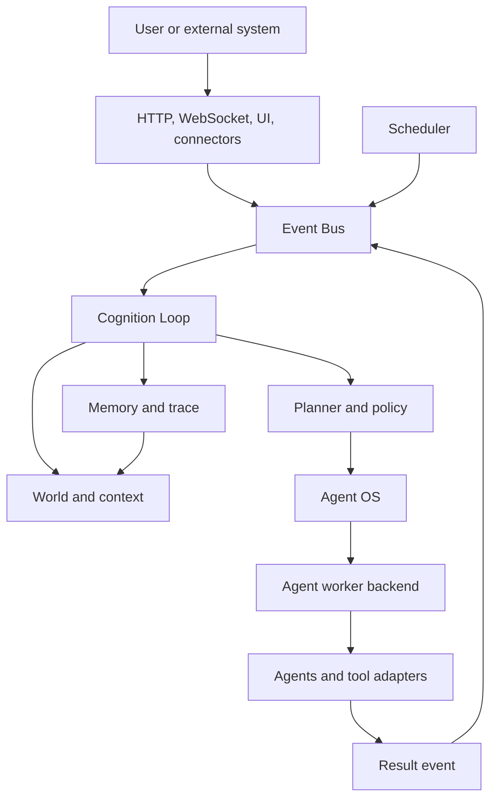
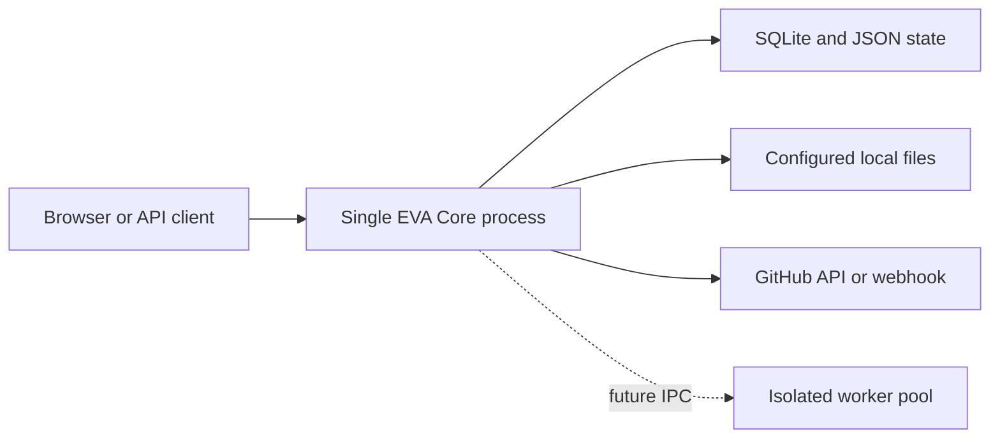

# EVA Runtime Architecture

Status: canonical for the stable runtime.

EVA is a single-node, event-driven cognitive assistant host. It combines a
FastAPI interface, a persistent event and memory layer, a continuous cognition
loop, pluggable agents, persona constraints, world state, scheduling, and
observability. It is not yet a distributed Agent OS or a hardened code sandbox.

## System Context



The stable control center is `CognitionLoop`. Events carry data; they do not
directly execute an agent. Agents return results and do not directly mutate the
world model or memory stores.

## Composition Root

`app/main.py` owns FastAPI lifecycle. `app/bootstrap.py` owns startup and
shutdown order. `app/composition.py` constructs replaceable components.

One running application is represented by `AppContainer`, grouped into these
subsystems:

| Subsystem | Responsibilities |
| --- | --- |
| `memory` | Storage adapter, memory API, repository, governor, tier manager, optional vector services |
| `persona` | User profile, self-model, persona repository, constrained persona service |
| `world` | Context builder, snapshots, world graph, proactive state |
| `agents` | Planner, registry, router, orchestrator, proactive engine, tools |
| `runtime` | Event bus, cognition loop, scheduler, results, policy, worker backend, health |
| `integrations` | GitHub connector and the optional MVSC bridge |

Flat `AppContainer` properties currently preserve route and test compatibility.
New code should use grouped access such as `container.memory.api` or
`container.runtime.loop`; compatibility properties can be removed after route
migration.

## Stable Dependency Direction

```text
app/interface
  -> event contracts
  -> cognition and policy
  -> agent_os
  -> agents
  -> executor/tool adapters

cognition -> world + memory + persona context
agents -> injected interfaces, not app settings or FastAPI
```

Rules enforced by `tests/test_architecture.py`:

1. Stable domain packages do not import `app`.
2. `packages/*` enters the stable runtime only through `app/experimental.py`.
3. Composition and configuration remain at the application edge.

## Runtime Lifecycle

Startup order:

```text
configuration and storage
-> persona and world restore
-> tool and agent registration
-> worker backend and cognition loop
-> scheduler and connectors
-> health, diagnostics, and API readiness
```

Shutdown reverses the active runtime dependencies: connectors and scheduler
stop first, then the cognition loop and agent worker, then state is persisted.

The scheduler publishes time and maintenance events. It does not bypass the
cognition loop to call agents.

## Event And Cognition Flow

The canonical user-message path is:

```text
POST /api/chat
-> normalize Event
-> publish to EventBus
-> CognitionLoop consumes event
-> update current state and build context
-> Planner selects task kind
-> AgentRouter selects registered agent
-> AgentWorkerBackend invokes orchestrator
-> AgentResult is normalized
-> memory, trace, world state, and result registry update
-> client receives result by polling, sync response, or WebSocket
```

The event schema is defined in `event/event_schema.py`. Event persistence and replay
support live in the storage layer. Priority-aware scheduling and durable broker
semantics are planned, not part of the current in-memory bus contract.

## Agent Execution Boundary

`runtime/agent_worker.py` defines the replaceable `AgentWorkerBackend` protocol.
The default `ThreadAgentWorkerBackend` provides bounded concurrency, timeout
reporting, streaming callbacks, stop handling, and runtime statistics.

Current security boundary:

- Agent execution is still in the EVA process.
- A timed-out Python thread cannot be forcibly terminated.
- Code execution uses a subprocess adapter when enabled, but this is not a full
  OS or container isolation boundary.
- File access is restricted to configured roots and privileged code/network
  tools are disabled by default.

The next backend must use long-lived worker processes or containers with an IPC
contract, hard CPU/memory/time limits, and worker replacement after faults.

## State, Memory, And Persona

These concerns are intentionally separate:

| Concern | Time horizon | Current implementation |
| --- | --- | --- |
| World state | Current and near-term | Runtime state plus `WorldModelGraph` and snapshots |
| Episodic memory | Historical events | Structured SQLite records with summaries and metadata |
| Tiered memory | Working to long-term | S1-S5 manager, retrieval, compaction, governance |
| Semantic retrieval | Long-term context | Optional embedding and vector components |
| Persona | Stable system behavior | Identity, principles, style, relationship, boundaries |
| Profile/self-model | Slowly changing context | JSON-backed profile and self-model stores |

Memory supplies background. World state supplies the present situation. Persona
constrains action and expression. None of them should be treated as raw chat
history.

## Stable And Experimental Pipelines

The stable runtime under `app`, `core`, `event`, `agent_os`, `agents`, `memory`,
`persona`, `runtime`, and `world` is the production-oriented path.

`packages/*` contains the MVSC research pipeline. It is disabled by default and
loaded through `app/experimental.py`. It may expose observability and ablation
APIs, but it must not become a second composition root or silently change the
stable event flow.

## Deployment Model

The supported MVP topology is one API process with local SQLite/JSON state.
Multiple Uvicorn workers are unsafe for the current in-memory event bus, result
registry, scheduler ownership, and SQLite coordination. Horizontal scaling
requires an external broker, shared result store, scheduler leader election,
and a production database.



## Implemented Capability Matrix

| Capability | Status | Notes |
| --- | --- | --- |
| REST, WebSocket, and dashboard | Implemented | Async, sync, stream, polling, health, metrics, debug surfaces |
| Event-driven cognition loop | Implemented | Continuous loop with trace and result integration |
| Agent registry and routing | Implemented | Built-ins plus constrained runtime registration |
| LLM adapters and tools | Implemented | Mock and configured providers; privileged tools opt-in |
| Structured/tiered memory | Implemented | SQLite/JSON persistence, retrieval, compaction, snapshots |
| Persona and self-model | Implemented | Stable constraints plus controlled updates |
| World relation graph | Partial | Lightweight graph and APIs; not a full graph database |
| Proactive behavior | Partial | Scheduler, cooldown, stagnation/reminder logic |
| GitHub integration | Partial | Polling/webhook path; calendar/filesystem connectors remain planned |
| Worker isolation | Boundary ready | Thread backend exists; process/container hard isolation is planned |
| Distributed runtime | Not implemented | Single-process deployment only |
| Graph plus vector hybrid memory | Experimental | Optional components need operational hardening |

## Architectural Risks

1. The cognition loop remains large and combines orchestration with result
   integration. Split it only after phase-level contract tests exist.
2. Compatibility properties temporarily expose a broad container surface.
3. SQLite and process-local queues constrain concurrency and availability.
4. Optional MVSC code can drift unless its bridge and feature flag stay strict.
5. External connector payloads and LLM tool calls remain untrusted input and
   must pass normalization, policy, scope, and audit checks.

The prioritized response to these risks is defined in
`docs/development-plan-v2.md`.
