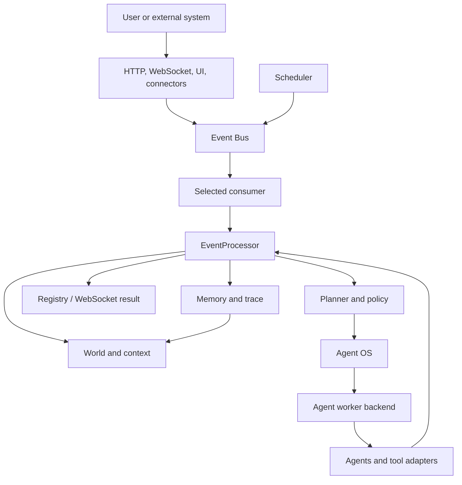
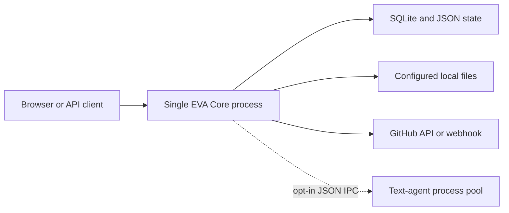

# EVA Runtime Architecture

Status: canonical for the stable runtime.

EVA is a single-node, event-driven cognitive assistant host. It combines a
FastAPI interface, a persistent event and memory layer, a continuous cognition
loop, pluggable agents, persona constraints, world state, scheduling, and
observability. It is not yet a distributed Agent OS or a hardened code sandbox.

## System Context



`RuntimeController` owns the selected consumer and its dependency lifecycle.
The default consumer is the FIFO `CognitionLoop`; `EventProcessor` is the shared
execution service. Events carry data; agents return results to that service.
See [Runtime Refactor v0.2](runtime-refactor-v02.md) for component contracts.

The shared v1 event envelope now lives in `event/contracts.py`; MVSC retains a
compatibility import. Stable consumers keep short `Event.type` names through
explicit, lossless mappings. EventBus validates and captures a private admission
snapshot. Historical rows use an explicit codec, while new storage writes retain
the envelope alongside existing columns. See [EVT-01](versioned-events-evt01.md).

An opt-in [Minimal Brain v0.1](minimal-brain-v01.md) uses one experimental
coordinator as the sole EventBus consumer. Independently timed state nodes and a
separate model projection worker continue while one slow worker calls the stable
`EventProcessor.process_event` boundary. The original FIFO consumer remains
unstarted. Attention uses graph activation and measured queue pressure to rank
waiting events; feedback enters the next bounded context. This mode is mutually
exclusive with MVSC and does not provide hard real-time or exactly-once execution.

`EVA_ENABLE_MVSC_PIPELINE=true` attaches MVSC experiment adapters while keeping
the HTTP consumer as legacy CognitionLoop. AdaptedCognitionLoop is not started
as that consumer. `/api/runtime` and the UI distinguish actual selection from
requested flags and successful/failed attachment. See [BASE-02](runtime-baseline-base02.md)
for HTTP wiring tests and the fixed offline timing/allocation baseline.

## Composition Root

`EVA_ENABLE_BUSINESS_GOALS=true` optionally attaches a SQLite goal store through
`app/experimental.py`. It uses the configured EVA database and canonical
ResultRegistry terminal notifications under either legacy or Minimal consumers.
`/api/goals` registers a goal against a known server task ID; a successful request
only makes the goal pending verification. The opt-in file verifier checks immutable
workspace file/hash expectations through `/api/goals/{id}/verify`; it commits sampled
evidence and goal state together with a goal-version fence. It cannot establish code
quality or accept posted observations/completed status. Startup interrupts unfinished goals without
replaying actions; shutdown closes the goal connection after worker shutdown.
Goal state and receipt projection commit together, but chat admission and the
in-memory result registry are outside that transaction. See [GOL-01](business-goals-gol01.md)
for failure, reconciliation, storage and latency limits.

`GET /api/goals/graph` uses a bounded SQLite read transaction through the injected
store. The particle UI switches between memory and goal-evidence projections;
goals, request receipts and sampled file checks have separate node categories.
This path does not use reconciling goal reads, advance expiry or invoke verification.
It displays persisted state and historical samples, not current filesystem guarantees.
The full UI can explicitly register immutable file goals via the existing authenticated
POST route. Ambiguous submissions require by-task lookup before another POST; that lookup
can reconcile state. Neither form registration nor projection refresh verifies files.
Goal evidence can reference existing EPI-01 rows in that same SQLite read snapshot,
matching the stored source event and Episode identities. Only bounded audit structure is
exposed; missing or invalid rows do not create nodes. The read-only integration does not
supply cross-component transactions.

`EVA_ENABLE_PROCESSING_EPISODES=true` independently enables durable processing drafts
and canonical-receipt Episode sealing in the configured SQLite database. The shared
EventProcessor writes a draft before effects and records agent invocations. Execution-thread
scopes record registry/Executor tool intents before handlers and bounded return receipts
afterwards; direct Agent I/O and child-thread internals are not individual tool receipts.
Nested entries carry parent action IDs. Unknown matching calls cannot be retried in the
same Episode, and sealing freezes outstanding tool receipts as unknown in the seal
transaction. No external idempotency guarantee is implied. Startup seals interrupted drafts using a
validated, already persisted goal receipt if available; otherwise the result is unknown.
Neither path replays actions. Seal, compact terminal receipt/outbox and draft removal
commit atomically in this store. Pending notifications are delivered idempotently to
goals before their startup recovery; a crash after goal commit but before notification
ack causes safe redelivery. World, memory, request admission, effects and goal commits
remain outside this transaction. Schema v2 uses
actual world snapshot hashes with unknown revisions, preserving v1 reads. The flag stays
off by default, and this recovery requires a single runtime instance. Receipt observers
are attempted independently; persistence errors cannot replace the first canonical
terminal reply. Connections close only after real worker shutdown. See [EPI-01](episode-records-epi01.md).

File Executor write intents also fix a bounded workspace path and expected byte hash
in that start transaction. Explicit authenticated `/api/tool-observations` requests
sample those fixed files outside the write transaction and append an observation only
if receipt/intent/count bindings still match. Samples never upgrade unknown receipts,
change goals or authorize retries. Historical graph reads remain read-only; the full
UI offers explicit checks and history reads. Unsupported and old calls have no inferred
checker. See [REC-01](tool-reconciliation-rec01.md).

The explicitly invoked MVSC pipeline additionally accepts a SQLite state repository
and its action dispatcher. Planned state, source events and pending ACT intent commit
atomically before the handler; feedback commits as another revision without advancing
the tick twice. Claimed actions recover as unknown and never lease-replay. Default
bootstrap leaves this MVSC loop disabled. An optional request dispatch ledger now
uses the same SQLite state/action boundary for the actual legacy/Minimal HTTP consumers.
World/memory effects outside ACT remain separate. See [ACT-01](state-action-transactions-act01.md).

Existing goal reconciliation can use the durable compact receipt after process-local
receipt loss; corrupt summaries fail with 503. Default chat polling/SSE require the
in-memory registry and cannot reconstruct reply text from this audit summary. The
runtime observation includes pending notification counts and local delivery errors.

`EVA_ENABLE_DURABLE_REQUESTS=true` adds durable admission and complete request
receipts to the shared registry. Before processing it atomically commits a scoped
dispatch revision, source, intent and claim. Retained replies survive restart; claimed
requests without validated terminal evidence become unknown, and unclaimed requests
are sealed as not executed when resume is disabled. Cross-store recovery
preserves known Episode/goal summaries without inventing missing reply text or review
results; goal business verification remains separate. This ledger is not the live
world state. The flag defaults off. See [ACT-02](durable-requests-act02.md).

`EVA_RESUME_DURABLE_REQUESTS=true` separately opts into startup recovery of proven
unclaimed, unexpired requests. A managed publisher queues only pre-startup candidates,
restores original deadlines/retention and retries backpressure. The existing processor
still claims durably and checks current policy before effects. Minimal reconciles only
matching interrupted snapshot entries; completed entries cannot be released by this
proof. Active business goals with matching unclaimed requests can continue. Claimed
unknown requests never re-enter execution. The producer stops before live dependencies
close. See [ACT-03](unclaimed-request-recovery-act03.md).

`EVA_ENABLE_ACTION_CONTEXT=true` additionally binds actual Agent inputs to a separate
durable invocation intent before entering the worker. World context projections carry
an instance-scoped revision; S2/S3 reads carry a persistent SQLite revision and pinned
row snapshot. The invocation intent commits with its dispatch revision and claim,
references the parent request action, and retains input hashes/IDs without context text.
Episode agent IDs can reference that same intent. Authenticated `/api/action-context/{task_id}`
reads these records without execution or reconciliation. World/memory preparation and
their separate read snapshots remain outside this action transaction; the world revision
does not survive reconstruction under the same scope. See [ACT-04](action-context-bindings-act04.md).

`app/main.py` owns FastAPI lifecycle. `app/bootstrap.py` owns startup and
shutdown order. `app/composition.py` constructs replaceable components.

One running application is represented by `AppContainer`, grouped into these
subsystems:

| Subsystem | Responsibilities |
| --- | --- |
| `memory` | Storage adapter, memory API, repository, governor, tier manager, optional vector services |
| `persona` | User profile, self-model, persona repository, constrained persona service |
| `world` | Context builder, snapshots, world graph, proactive state |
| `agents` | Planner, registry, router, orchestrator, proactive engine, tools |
| `runtime` | Event bus, controller, event processor, FIFO adapter, scheduler, results, policy, worker backend, health |
| `integrations` | GitHub connector and the mutually exclusive MVSC / Minimal Brain bridges |

Flat `AppContainer` properties currently preserve route and test compatibility.
New code should use grouped access such as `container.memory.api` or
`container.runtime.loop`; compatibility properties can be removed after route
migration.

## Stable Dependency Direction

```text
app/interface
  -> event contracts
  -> cognition and policy
  -> agent_os
  -> agents
  -> executor/tool adapters

cognition -> world + memory + persona context
agents -> injected interfaces, not app settings or FastAPI
```

Rules enforced by `tests/test_architecture.py`:

1. Stable domain packages do not import `app`.
2. `packages/*` enters the stable runtime only through `app/experimental.py`.
3. Composition and configuration remain at the application edge.

## Runtime Lifecycle

Startup order:

```text
configuration and storage
-> persona and world restore
-> tool and agent registration
-> worker backend and cognition loop
-> scheduler and connectors
-> health, diagnostics, and API readiness
```

Shutdown closes EventBus ingress before stopping producers and the selected
consumer. Tracked worker and scheduler callbacks must finish before persistence
and storage cleanup. Failed steps retain downstream dependencies; retries skip
already completed steps. `/api/runtime` exposes the real phase and failures.

The scheduler publishes time and maintenance events. It does not bypass the
cognition loop to call agents.

## Event And Cognition Flow

The canonical user-message path is:

```text
POST /api/chat
-> normalize Event
-> publish to EventBus
-> Selected consumer dispatches to EventProcessor
-> update current state and build context
-> Planner selects task kind
-> AgentRouter selects registered agent
-> AgentWorkerBackend invokes orchestrator
-> AgentResult is normalized
-> memory, trace, world state, and result registry update
-> client receives result by polling, sync response, or WebSocket
```

The event schema is defined in `event/event_schema.py`. Event persistence and replay
support live in the storage layer. Priority-aware scheduling and durable broker
semantics are planned, not part of the current in-memory bus contract.

EVT-00 protects admitted user/correlated events from eviction; only uncorrelated
ticks and maintenance are replaceable. Chat reserves a bounded ResultRegistry
entry before publication and claims it before side effects. Request deadlines
and terminal retention use a monotonic clock. The first terminal wins, reads are
repeatable, missing/expired receipts return 404, and SSE reads the same registry.
Shutdown immediately rejects waiting requests while active work retains its real
lifetime. These are process-local receipts, not durable admission or proof of
business-goal completion. See [EVT-00](request-receipts-evt00.md).

## Agent Execution Boundary

`runtime/agent_worker.py` defines the replaceable `AgentWorkerBackend` protocol.
The default `ThreadAgentWorkerBackend` provides bounded concurrency, timeout
reporting, streaming callbacks, stop handling, and runtime statistics.

Current security boundary:

- The default thread backend executes agents in the EVA process.
- A timed-out Python thread cannot be forcibly terminated.
- Code execution uses a subprocess adapter when enabled, but this is not a full
  OS or container isolation boundary.
- File access is restricted to configured roots and privileged code/network
  tools are disabled by default.

The opt-in `ProcessAgentWorkerBackend` runs chat/docs text agents in long-lived
spawn processes. It uses bounded JSON IPC, distinct queue/execution deadlines,
heartbeats and replacement after faults or a task-count limit. Core retains
executor gates, audit and final response review. Raw tokens are held until review.
File agents and tools are unavailable in process mode; no fallback is automatic.
Core helper callables still use bounded local threads. CPU/memory limits,
descendant cleanup and a privileged tool broker remain planned; this is not an
OS sandbox. See [Process Workers](process-workers.md) for configuration and limits.

## State, Memory, And Persona

These concerns are intentionally separate:

| Concern | Time horizon | Current implementation |
| --- | --- | --- |
| World state | Current and near-term | Runtime state plus `WorldModelGraph` and snapshots |
| Episodic memory | Historical events | Structured SQLite records with summaries and metadata |
| Tiered memory | Working to long-term | S1-S5 manager, retrieval, compaction, governance |
| Semantic retrieval | Long-term context | Optional embedding and vector components |
| Persona | Stable system behavior | Identity, principles, style, relationship, boundaries |
| Profile/self-model | Slowly changing context | JSON-backed profile and self-model stores |

Memory supplies background. World state supplies the present situation. Persona
constrains action and expression. None of them should be treated as raw chat
history.

World graph recovery merges snapshot and S4 records by entity ID and edge triple.
New graph snapshots use `graph_schema_version=2` and retain record timestamps
and provenance; unversioned and v1 snapshots remain readable. S4 is read using keyset pagination.
Newer comparable timestamps win; S4 wins ties or unknown ordering. Snapshot-only
and unflushed local records survive. Recovery is staged before committing the
in-memory graph and runs before producers start. See
[RST-01 recovery rules](world-restore-rst01.md) for conflict, compatibility and
rollout limits.

Minimal Brain model observation now calls the bounded `context_projection()`
instead of serializing the graph and then slicing it. The view excludes edges
and arbitrary task properties; recent selection still scans entities. Offline
backup, conflict diagnostics and verified recovery copies are available through
`python -m scripts.world_recovery`. See [RST-02](world-recovery-rst02.md) for the
copy-only migration contract, measurements and test-isolation correction.

New S1–S4 content preserves versioned provenance and epistemic labels. User
statements and assistant inferences are not automatically verified facts.
Promotion to S3 now also requires explicit retention authorization; other history
and event persistence remains unchanged. Summaries retain input origins and cannot
increase confidence simply through compression.

S4 preserves current field origins for entity names/properties and an origin for
each relation. Partial updates retain untouched field origins; mixed entities
are unknown as a whole. Reply extraction always writes assistant inferences.
Bounded context, memory explorer APIs and the UI retain these labels; simulation
and tool observation remain distinct. Recovery bundles now use v2 provenance
fingerprints while verifying old v1 bundles under their original rules. This is
not an immutable evidence ledger or factual verification. See [EVD-01](world-provenance-evd01.md).

The orchestrator checks structured response declarations before publishing final
text. Streaming therefore delivers reviewed final text rather than live drafts.
`contract_checked` is a mechanical receipt check, not factual verification;
unstructured responses are explicitly `not_assessed`. See
[Assistant v0.1 Integration](assistant-v01-integration.md) for the contract and limits.

## Stable And Experimental Pipelines

The stable runtime under `app`, `core`, `event`, `agent_os`, `agents`, `memory`,
`persona`, `runtime`, and `world` is the production-oriented path.

`packages/*` contains optional Minimal Brain and MVSC runtimes. They are disabled by default and
loaded through `app/experimental.py`. It may expose observability and ablation
APIs, but it must not become a second composition root or silently change the
stable event flow.

## Deployment Model

The supported MVP topology is one API process with local SQLite/JSON state.
Multiple Uvicorn workers are unsafe for the current in-memory event bus, result
registry, scheduler ownership, and SQLite coordination. Horizontal scaling
requires an external broker, shared result store, scheduler leader election,
and a production database.



## UI Presentation and Brand Components

The chat and brand workspace share immutable logo tokens, exact 2×2×2 / 3×3×3
state, serialized legal turns and inverse journals. A renderer failure shows a
separate static mark without changing chat admission or result delivery. Explicit
retry validates the state against its committed journal, rebuilds the renderer
using the same state object and reverses only committed moves. Inconsistent state
remains an error; static presentation is not a successful restoration receipt.
See [Cube Logo](cube-logo.md) and [Brand System](brand-system.md). Browser delivery
and independent offline execution have separate acceptance evidence and limits in
[UI / Logo M1 Acceptance](ui-logo-m1-acceptance.md).

## Implemented Capability Matrix

| Capability | Status | Notes |
| --- | --- | --- |
| REST, WebSocket, and dashboard | Implemented | Async, sync, stream, polling, health, metrics, debug surfaces |
| Event-driven cognition loop | Implemented | Continuous loop with trace and result integration |
| Agent registry and routing | Implemented | Built-ins plus constrained runtime registration |
| LLM adapters and tools | Implemented | Mock and configured providers; privileged tools opt-in |
| Structured/tiered memory | Implemented | SQLite/JSON persistence, retrieval, compaction, snapshots |
| Persona and self-model | Implemented | Stable constraints plus controlled updates |
| World relation graph | Partial | Lightweight graph and APIs; not a full graph database |
| Proactive behavior | Partial | Scheduler, cooldown, stagnation/reminder logic |
| GitHub integration | Partial | Polling/webhook path; calendar/filesystem connectors remain planned |
| Worker isolation | Partial | Opt-in text-agent process lifecycle; OS resource sandbox and tools remain planned |
| Distributed runtime | Not implemented | Single-process deployment only |
| Graph plus vector hybrid memory | Experimental | Optional components need operational hardening |

## Architectural Risks

1. The cognition loop remains large and combines orchestration with result
   integration. Split it only after phase-level contract tests exist.
2. Compatibility properties temporarily expose a broad container surface.
3. SQLite and process-local queues constrain concurrency and availability.
4. Optional MVSC code can drift unless its bridge and feature flag stay strict.
5. External connector payloads and LLM tool calls remain untrusted input and
   must pass normalization, policy, scope, and audit checks.

The prioritized response to these risks is defined in
[Source Review and Roadmap v3](source-review-and-roadmap-v3.md).
