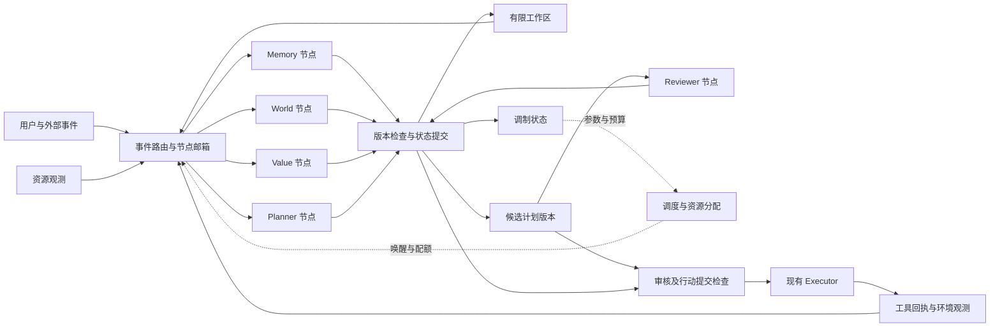

# EVA Cognitive Dynamics v1：并发循环与多时间尺度设计

状态：研究设计草案，尚未实现的行为均为提案。基线核对日期：2026-09-11。

后续已有 [Minimal Brain v0.1](minimal-brain-v01.md) 的有限实现。本稿保留设计时的基线差距与较完整目标，当前实验行为和限制以该实现说明为准。

本稿整合本轮十二份架构附件及“动态并行循环多时间尺度”的修正，并对照当前工作区代码。它不是完整人脑模型，也不是已经验证的认知理论。现有行为以代码、测试及 [当前架构](architecture.md) 为准；实施顺序以 [开发计划](development-plan-v2.md) 为准。

**目标：让持久化的认知状态、独立调度的计算节点和有边界的反馈连接共同决定行为，并能通过干预实验验证每种机制是否有用。**

## 1. 保留方向，同时修正前提

| 原表述或隐含前提 | 本稿采用的精确定义 |
| --- | --- |
| 三维结构意味着不是链条 | 空间维数不能推出计算拓扑。EVA 明确建模有向连接、反馈、延迟与状态依赖的影响。 |
| 每个模块必须是长期运行的进程 | 节点需要持续存在的状态与可独立调度的生命周期；不要求各自占用一个 OS 进程，也不要求无输入时持续计算。 |
| 多时间尺度不能使用统一时钟 | 可以共用单调时钟；不同节点有不同唤醒条件、时间常数、计算时限和最大等待时间。统一 tick 也可实现多速率调度。 |
| 把所有调用改为并行 | 没有依赖的计算可以重叠；使用某一版本计划的审核必须等待该版本产生，行动提交仍有确定顺序。 |
| 模块访问同一可变状态就能协同 | 工作节点读取带版本的快照，提交增量建议；内核检查读写版本并原子提交。共享可变字典不能替代一致性协议。 |
| 连接权重变化就是学习 | 短时门控、增益变化、长期参数学习、拓扑修改分别记录。警报消失后应能撤销临时调制。 |
| 激活最高就应执行 | 激活只参与资源和工作区选择；行动还须满足前置条件、审核、权限、预算与当前状态约束。 |
| 参数能调制，所以权限也随之增大 | 调制可在已授权范围内缩减能力、调整预算或申请额外能力；权限扩大必须经过独立策略决策。 |
| 世界模型慢，感知模型快 | 同一模型也包含多种速度：当前对象状态可迅速变化，长期统计与结构变化较慢。 |
| 数值状态、持续运行或 ΔS 证明体验 | ΔS 在此仅表示可观测状态变化；这些机制不构成主观体验的证明。 |

科研依据需要限定范围：Murray 等在猕猴多个皮层区域观察到内在活动时间尺度的层级差异；论文中的时间尺度是统计量，不是软件模块的调用周期，也不是人格变化周期。[原始研究，2014](https://johndmurray.org/papers/murray_2014_nn.pdf)

Li 与 Wang 分析了具有解剖连接约束的皮层模型，讨论兴奋、抑制和连接结构在模型内形成不同时间尺度的条件。这支持研究“拓扑与动力学的关系”，不能直接验证 EVA 的节点划分或下面的公式。[原始建模研究，2022](https://ins.sjtu.edu.cn/people/songtingli/resources/journal/Li_Wang_PNAS_2022.pdf)

“Transformer 类似皮层计算器”“情绪类似调音台”只能作为功能类比；本稿不采用脑区与软件模块一一对应的假设。Global Workspace 是可选的有限容量广播机制，不以模块名称证明意识。

## 2. 当前代码与目标之间的差距

以下是静态代码核对结果，不是本轮运行或性能测试结论。

| 能力 | 当前可定位依据 | 需要补充的契约 |
| --- | --- | --- |
| 常驻事件处理与并发任务 | `core/cognition_loop.py` 的 `start`、`_run_forever`；`runtime/agent_worker.py` 的工作池 | 当前按事件执行 `_process_one`；多个 worker 并发处理不同事件，不等于 Memory、Planner、Reviewer 对同一事件独立持续运行。 |
| 多周期后台任务 | `runtime/scheduler.py` 分别调度 tick、maintenance、snapshot | 已有多周期基础；尚需节点级 deadline、预算、唤醒合并与公平性。 |
| 事件传递 | `event/event_bus.py` 的有界 `Queue` 与 `consume` | 当前是竞争消费，不是每个订阅节点各收一份的广播。满队列可丢事件；持久化捕获也不等于可靠交付与确认。 |
| 世界图 | `world/world_model.py` 的 `Entity`、`Edge`、`WorldModelGraph` | 表达对象及语义关系；不能直接把 `owns`、`depends_on` 的权重当运行时调制增益。 |
| 注意力与工作区原型 | `packages/cognition/loop.py` 的 `Attention`、`Workspace`、`PipelineCognitionLoop.run_once` | 实验版 `run_once` 仍依次 await 多个阶段；需要独立节点、异步结果整合与输入版本语义。 |
| 注意力参数是否生效 | `packages/cognition/loop.py` 的 `Attention.weights`、`select`；`packages/contracts/state.py` 的 `ContentCandidate.priority` | `select` 按候选的 `priority` 排序，后者使用固定系数；修改该 `weights` 配置没有参与这里的排序计算。 |
| 规划与预测原型 | `core/planner.py` 的 `Plan`、`Planner`；`core/prediction.py` 的 `_compute_error` | 稳定 Planner 当前负责事件到 Agent 的路由；预测误差使用文本词集合相似度，尚不能据此称为多方案模拟或概率校准。 |
| 实验事件订阅与状态存储 | `packages/kernel/event_bus_adapter.py`、`packages/kernel/state_bridge.py`、`packages/kernel/event_store.py` | 现有订阅通知逐个 await；回放和版本基础需审查后复用，不能当作完整并发协议。 |
| 来源与行为约束 | `memory/provenance.py`、`core/response_review.py`、`core/policy_engine.py` | 复用已有边界，同时补充证据依赖失效、版本化计划审核和行动提交前复查。 |

因此，改造对象是现有事件驱动运行时中的认知计算与提交契约，不是从零再建一套事件、记忆、Agent 系统。实验代码仍遵循 [模块边界](architecture-boundaries.md)，通过 `app/experimental.py` 接入。

## 3. 一张逻辑网络，三种不同的图

| 图 | 节点与边 | 主要问题 |
| --- | --- | --- |
| 运行图 Runtime Graph | 计算节点；订阅、信号传递、调制连接 | 谁在什么条件下影响谁，谁获得资源？ |
| 知识图 Knowledge Graph | 对象、事件、信念、证据；属于、支持、反驳、派生关系 | 系统关于世界知道什么，依据是什么？ |
| 任务图 Task Graph | 目标、候选计划、步骤；依赖与冲突关系 | 什么必须先完成，什么可以同时执行？ |

Self、World、Memory 可以成为统一知识接口下的不同视图，使用共享实体标识；仍保留观测、解释、历史记录、模拟分支之间的类型与来源边界。统一查询不要求一个物理数据库，更不要求把每条记忆注册成常驻 worker。



图中的提交服务只做短事务与一致性检查，不执行模型推理。串行提交与并发计算可以并存。模块间有选择地传递局部信号，只有需要跨模块协调的候选内容进入工作区，避免每次变化引发全网广播。

## 4. 节点、连接和事件的最小契约

下面是拟议字段，不是已存在的 Python API。

| 契约 | 必需内容 |
| --- | --- |
| `NodeSpec` | `node_id`、订阅类型、状态所有权、允许输出、执行器类型、周期或事件触发条件、最小唤醒间隔、deadline、最大并发数、预算上限 |
| `NodeState` | `version`、类型化局部状态、activation、已处理输入位置、上次更新时间、当前运行标识、实际资源消耗 |
| `RuntimeEdge` | `edge_id`、源与目标、传输的信号及单位、signal/modulation 类型、非负基础权重、独立正负号、延迟、门控、增益上限、配置版本 |
| `Signal` | 信号值及单位、生产节点、源状态版本、发出时间、可见时间、有效期、因果根标识 |
| `NodeResult` | 输入事件标识、读取的对象版本、运行标识、建议状态增量、候选内容、派生事件、已消耗预算 |
| `ModulationProposal` | 来源、目标参数、目标节点、数值、有效期、合成规则、允许范围、引用证据 |
| `ActionProposal` | 目标及计划版本、前置条件、证据引用、审核要求、工具与参数摘要、预算、幂等键 |

`activation` 是调度特征，不是命题可信度。不同节点的原始分数在归一化规则未定义前不能直接比较。CPU 比例、token 数、货币成本和情绪标签也不能未经定义地相加。

时钟分工：单调时间用于进程内超时、衰减和延迟；UTC 用于记录与跨重启截止时间；提交序号用于回放顺序。重启时重新建立单调时间基准，不比较两次启动的原始单调时间值。模拟器使用可控逻辑时钟。

## 5. 第一版动力学：明确时间、符号与假设

以下是待验证的控制模型。业务状态仍由类型化 reducer 更新；不把完整世界状态压成一个激活度数字。

对每条从 j 到 i 的运行连接，定义：

```text
w_eff_ji(t) = sign_ji × w_base_ji × gate_ji(t) × gain_ji(t)

sign ∈ {-1, +1}
w_base ≥ 0
gate ∈ [0, 1]
gain ∈ [0, gain_max]
```

正负号只编码一次，避免“负权重 × inhibitory”反而变成促进。首版固定 `w_base` 和拓扑，仅允许有范围、有有效期的 gate/gain 调整。学习基础权重属于后续实验。

每个节点保存最近已送达的有效输入。延迟通过 `available_at = emitted_at + delay` 实现；不得在当前时刻读取尚未可见的未来结果。过期信号不再产生作用，但过期本身也需要触发输入重算。

定义该节点在一个输入保持不变的时间段内的目标激活：

```text
z_i = baseline_i + external_input_i
      + Σ(w_eff_ji × latest_valid_signal_ji)
q_i = sigmoid(z_i)

α_i = exp(-Δt / τ_i),  τ_i > 0, Δt ≥ 0
a_i(t + Δt) = α_i × a_i(t) + (1 - α_i) × q_i
```

`τ_i` 为响应时间常数，和执行耗时、调度周期不是同一变量。收到新信号或调制变化时，先使用旧 `q_i` 推进到该事件时刻，再计算下一时间段的新 `q_i`。否则会把刚到达的警报错误地施加到过去整段空闲时间。

这种按事件分段、区间内保持输入的定义，允许节点跳过空闲轮询。它是数值实现选择，不保证与连续神经动力学相同。若反馈依赖连续输出，应明确采样周期或阈值跨越事件，并检查不同采样分辨率下结果是否收敛。

实际运行中，信号在到达且满足可见时间后，于内核接受时刻生效；迟到信号不回拨节点时间。到达时已过期的信号失效，同一来源的旧版本不得覆盖较新的有效版本。离线模拟器可按逻辑可见时间运行，但须按时间排序；同一时刻的事件按固定序号处理。这两种运行模式分别记录，不能混用时间语义。

这里的更新在合法初值下保持 `a_i ∈ [0,1]`，但**有界不等于稳定**：环路仍可能振荡、饱和或持续抢占资源。要通过延迟扰动、强反馈、警报撤除和竞争任务等实验检查行为；裁剪数值不能替代稳定性分析。

Drive 的方向必须按变量定义。例如记忆压力超过目标上限时：`overload = max(0, observed_pressure - target_pressure)`；对于可用预算不足，则是 `deficit = max(0, target_budget - available_budget)`。二者不能套用同一符号约定。

## 6. 并发、调度和调制怎样真正生效

每个逻辑节点有独立的有界邮箱；首版每节点最多一个运行实例。内核根据输入、定时器和预算决定何时运行，工作节点将耗时计算提交给现有 worker 能力。阻塞 I/O 或 CPU 计算不得直接占住调度线程；仅写 `async` 或逐个 `await` 并不能证明并发。

工作池还需按任务类型隔离或预留容量。若 Planner 占满全部槽位，另起快速节点也无法保证快速响应。线程超时仅意味着调用方停止等待；需要可终止计算时使用支持终止的进程边界，并分别记录“请求取消”“确认停止”“忽略迟到结果”。

取消须原子撤销 `run_id` 的提交资格或推进运行代次；结果提交除检查数据版本，还检查该运行是否仍有效。取消先提交则拒绝后续结果；动作已经提交时转入动作取消或对账流程。未确认停止的计算继续占实际执行容量，不因等待超时而把同一物理槽位重复分配。

资源分配先检查 eligibility，再进行排序和配额分配：

1. 检查节点状态、输入新鲜度、前置条件和授权范围。
2. 对符合条件的任务，按明确优先级类别、deadline、等待时长及归一化激活分配资源。
3. 为关键观测预留容量，为可持续服务的普通任务提供最小份额；持续超载时拒绝或降级新增工作，不能承诺所有任务均按时完成。
4. 对每类资源分别满足 `Σ allocation_i ≤ available_capacity`，并记录额度预留、实际使用与释放。

风险上升可以提高诊断候选优先级、压低探索预算、缩短计划有效期；执行高影响操作所需的审核不因此放宽。高优先级也不自动表示更真实。

多个调制来源不能直接同时改目标对象。内核按参数声明的规则合成，例如预算上限取最小值、禁止条件取并集、排序增益按有界求和处理。决策记录包含参与合成的来源及结果；某项到期后移除该项并重新合成剩余有效调制，没有有效调制时才恢复基线。不同参数不能共用一个未经定义的“加权平均”。

工作区选的是带内容、来源、证据、任务归属和有效期的候选项；同一来源的重复内容合并，多任务保留配额。可用切换滞回和等待加权减少反复切换；它不是单一全局 `argmax` 行动开关。

## 7. 状态提交、循环边界与行动一致性

**并发计算，受控提交。** 节点从快照读取数据，只能建议修改自身拥有的字段；跨领域修改发给状态所有者。提交携带 read-set 与对应版本：相关版本未变才接受；冲突时丢弃、重算或执行明确的领域合并规则，不默认最后写入覆盖一切。

Reviewer 对具体 `plan_id + version + 参数摘要` 出具审核。Planner 可以继续生成下一版本，但旧版本的通过结果不得自动覆盖新版计划。行动提交前再次检查计划、前置条件、权限与预算；能在工具端原子检查的资源条件应在那里检查，不能仅依赖较早的世界快照。

事件路由至少区分两类：

- 可合并状态采样：如同一资源的连续 CPU 读数，只保留最新有效采样，并记录合并数量。
- 必须处理的业务事件：用户请求、行动结果、取消请求、审核结果等，在接受后持久化并确认处理；队列满时明确背压或拒绝，不能静默套用 `drop_oldest`。

若需要可靠广播，应在稳定事件基础设施上定义按订阅者的 inbox、确认与重投；不让多个节点直接争抢现有 `consume()`，也不让旧循环和新循环各自执行一次同一请求。按任务明确运行所有者，影子模式不产生外部动作。

一次内核事务应包含：状态更新、已处理事件标识、派生事件 outbox。消费者用 `(event_id, consumer_id)` 去重。网络与进程故障下按至少一次交付设计；工具支持幂等键时用于避免重复副作用。不支持幂等的工具在结果未知时进入对账状态，不能盲目重试并声称“恰好一次”。

循环允许发生，但资源必须有限：同一因果根有时间、事件数、重规划次数和预算上限；TTL、去重、最小重发间隔、变化阈值共同抑制回声。新观测可以启动下一轮受预算约束的反馈，不把所有循环一律视为错误。

回放分为两种：状态重建按已提交记录还原状态与既成决策；决策复算还须固定 reducer、调度器及模型配置版本，记录有效输入次序、时间、调制、随机选择、超时、取消、丢弃与合并等输入，才能比较重新计算的结果。两者均使用已记录的外部观测和模型输出；重新调用模型或工具是新实验，不叫确定性回放。快照恢复只恢复内部状态；已发送的消息或外部操作需要单独补偿，不能靠回滚数据库撤销。

## 8. 信念、目标、模拟和学习如何接入

| 系统 | 本轮附件可保留的机制 | 必须补充的边界 |
| --- | --- | --- |
| Self / World / Memory | 共享实体标识、视图、事件来源与历史连续性 | 区分“观测到一个陈述”和“该陈述为真”；Self 能力信息来自配置、授权与执行证据。 |
| Belief | 命题、支持与反对证据、派生关系、状态修订 | 区分信源可靠性和命题概率；无校准时数字叫评分。转载或内部回声不算新增独立证据，反证应使依赖结论重新评估。 |
| Goals / Value / Drive | 用户目标锚点、前置条件、维护需求、资源压力 | 分开“想做什么”“允许做什么”；目标成功需可观测验收，不能以生成了回答或降低内部焦虑替代。 |
| Planner / Reviewer | 多个候选、计划版本、依赖关系、逐版本评估 | 并发产生与审查部分方案；只有审核覆盖的版本才能提交动作。 |
| Simulation | 带假设的分支状态和后果预测 | 模拟器无真实工具写权限；模拟结果标明分支及模型版本，不能进入现实观测表冒充结果。 |
| Learning | 预测与结果配对、错误分类、候选参数更新、保留评估集 | 一次概率预测落空不直接证明模型错误；模型自评或模拟中的成功不能单独确证现实提升与因果归因。 |
| Self-modification | 版本化候选、独立评估、可恢复发布 | 首版不做运行时代码自改；优先离线评估受限配置或策略更新。内部可回滚与外部可补偿分别验证。 |

预测须在结果发生前记录目标变量、时间范围、适用条件和评分方式。数字概率使用对应观测任务校准；文本相似度只能作为该文本任务的特征，不能直接充当通用预测误差或模型能力指标。

知识声明分别记录 `observed_at/valid_time` 和 `recorded_at`。当前投影按领域规则处理时间、来源与冲突；旧观测可以补充历史，不能仅因较晚抵达便成为最新事实。提交版本检查不能替代事实有效时间检查。

只有互斥且穷尽的假设集合才归一化为总概率 1；CPU、数据库和网络原因可以并存。未知原因、未列举解释与估计不确定性分别定义，不能把剩余概率质量直接等同于认知不确定性。缺少这些定义时保留评分或未知，不输出伪精确概率。

本稿不能判断这些机制是否产生主观意识：**现有信息不足，无法判断。** 工程上可检验的是持续性、正确性、适应性、资源效率与恢复能力。

## 9. 首个实验范围与接入顺序

建议首个实验采用资源异常场景，运行六个逻辑节点：资源观测、Memory 检索、World 更新、Value/Attention 调制、Planner、Reviewer。Action 通过现有执行边界接入。用确定性假数据与受控慢任务先验证内核，再接真实模型。

首个反馈环：资源负载升高 → 诊断候选获得资源 → 执行已授权的内部降载 → 新资源观测 → 调制衰减与普通任务恢复。工作区、节点状态、预算与因果记录均可检查。

迁移依赖顺序如下，是研究方案，不改变当前 backlog 的已承诺次序：

| 步骤 | 工作内容 | 进入下一步的证据 |
| --- | --- | --- |
| A：契约与基线 | 衔接 `COG-01`、`EVT-01`；定义 typed event、read-set、结果整合和虚拟时钟 | 现有请求行为不变；记录可用于比较的顺序运行基线。 |
| B：离线调度实验 | 节点邮箱、独立期限、延迟信号、预算预留、配置化门控 | 下表的并发、多速率、调制和循环实验通过。 |
| C：影子接入 | 同一输入产生网络候选，只比较，不重复执行；实验桥接现有存储与 worker | 每个任务只有一个行动所有者；可定位所有候选差异。 |
| D：受限行动 | 对明确任务启用新提交路径、版本审核、幂等/对账、恢复 | 通过重复交付、迟到审核、崩溃恢复和旧接口回归检查。 |
| E：学习实验 | 在机制运行稳定后加入受限参数更新和独立评估 | 对保留任务集有可重复收益，且恢复与约束指标不退化。 |

不为每个概念新开一个大模型常驻推理循环。某个节点是否需要模型调用，由输入信息、任务收益和预算决定。进程数量根据隔离和实际负载测量决定，不能从“像大脑”直接推导。

## 10. 用可失败的实验验收

所有数值阈值由基准环境、业务要求与测试配置明确给出，不能把附件示意值当生理事实或现有性能结果。

| 实验 | 应观测到的行为 | 失败意味着什么 |
| --- | --- | --- |
| 慢规划与快速观测 | 人为挂起 Planner，资源观测、取消和新的用户输入仍能在其预算内处理；确认 worker 容量有隔离或预留 | 名义上多节点，实际仍被同一阻塞点串行化。 |
| 多时间尺度 | 由虚拟时钟推进，相同输入时序在不同调度步长下符合已定义分段语义；空闲时无需持续唤醒所有节点 | tick 次数被误当物理时间，或新输入被追溯作用于过去。 |
| 调制干预 | 相同事件与初态，仅改变允许的风险调制，实际队列次序或资源份额变化；到期恢复；权限不扩大 | 参数只是展示字段，或调制越过行动边界。 |
| 延迟及过期 | 信号可见前不影响目标；到期后撤销影响；记录延迟结果是否仍适用 | 读取未来或过期状态。 |
| 乱序观测与取消 | 先收到新观测，再收到旧观测，当前投影不被旧事实覆盖；取消后即使数据版本未变也拒绝该运行结果 | 到达时间混同事实时间，或取消只改变了界面状态。 |
| 强反馈与报警撤除 | 有界输入下，事件量受限；报警消失后按验收窗口恢复；无持续风暴或永久饥饿 | 数值有界仍产生不良系统行为。 |
| 并发冲突与计划变更 | 两个结果基于旧版本修改同一事实，冲突被显式处理；旧审核不能放行新计划 | 状态、证据或行动版本不一致。 |
| 重投、崩溃与恢复 | 同一事件重投不会重复内部提交；外部动作可幂等或进入对账；回放不再次调用工具 | 日志捕获被误当执行可靠性。 |
| 证据回声 | 同一来源经 Memory、World、Planner 多次转述，可信度不因转述次数自动增加 | 循环放大了未经验证的断言。 |
| 公平性与超载 | 低优先级任务在声明的可承载条件下得到份额；持续超载产生可见拒绝/降级 | 激活竞争使长期任务永久无法运行。 |
| 消融与成本比较 | 对相同任务集、模型和预算，分别禁用反馈、调制或多速率；比较完成率、响应分位数、错误行动、token/时间成本 | 复杂机制未表现出收益，需保留更简单实现。 |

验收不能以“图看起来像神经网络”或“增加了 activation 字段”为准。最终要能从一条行为回溯到输入、状态版本、证据、资源分配与具体生效的连接；也要能关闭某个机制，检验其是否造成预期差异。
