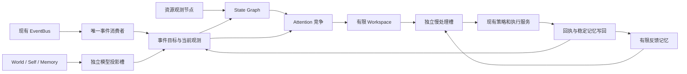

# EVA Minimal Brain v0.1

状态：可选实验运行时，默认关闭。它实现的是最小并发控制闭环；“Brain”是项目名称，不表示已经复现人脑或意识。

本实现承接 [认知动力学设计](cognitive-dynamics-v1.md) 中的最小范围：已有事件来源进入统一调度，快速状态节点持续推进，慢认知调用现有处理服务，执行回执更新状态并影响下一次处理。本文说明具体代码行为与限制。

架构已在 [运行时重构 v0.2](runtime-refactor-v02.md) 中升级：统一 RuntimeController 管理生命周期，EventProcessor 独立于消费线程；节点调度、GoalLedger、ValuePolicy、AttentionPolicy 和 GlobalWorkspace 均有独立契约。本页保留最小闭环的运行方式与范围。

## 运行

先运行无需网络、使用临时快照和显式 MockLLM 的演示：

```powershell
python -m packages.minimal_brain.demo
```

保存演示证据：

```powershell
python -m packages.minimal_brain.demo --output artifacts/minimal-brain-demo.json
```

演示会用一个可控阻塞任务占据认知执行槽，检查 Body 和 Attention 是否继续更新；随后提高演示资源压力，检查维护候选是否改变排队次序；释放认知任务后检查反馈、重复交付去重和快照恢复。演示资源压力是注入的测试输入，不是本机 CPU 测量。

在应用中启用：

```powershell
$env:EVA_ENABLE_MINIMAL_BRAIN = "true"
$env:EVA_ENABLE_MVSC_PIPELINE = "false"
python -m uvicorn app.main:app --host 127.0.0.1 --port 8000
```

沿用现有 API token、LLM 和工具配置。若要仅用模拟模型，额外设置 `EVA_LLM_PROVIDER=mock`。关闭 minimal 标志并重启后使用原运行时；minimal 与 MVSC 同时启用会使配置验证失败。

| 配置 | 默认值 | 含义 |
| --- | --- | --- |
| `EVA_ENABLE_MINIMAL_BRAIN` | `false` | 选择新调度内核作为事件消费者 |
| `EVA_MINIMAL_BRAIN_QUEUE_CAPACITY` | `64` | 内核中等待执行的事件上限，不含一个正在执行的事件 |
| `EVA_MINIMAL_BRAIN_POLL_SEC` | `0.02` | 应用调度线程检查期限的间隔 |

默认内部节点期限：Body 50 ms、Attention 100 ms、Goals 250 ms、模型投影 1 s。这些是工程默认值，不是生理测量或硬实时保证；实际响应还受 OS 调度和回调耗时影响。单调时钟可在测试中替换。

## 八个最小组成部分

| 部分 | 本版实现 |
| --- | --- |
| Kernel | `packages/minimal_brain/kernel.py`：单一状态所有者、可注册周期节点、有界等待队列、一个慢处理槽与独立模型投影槽；应用由 RuntimeController 管理生命周期 |
| State Graph | `packages/minimal_brain/state_graph.py`：激活状态、固定有向正负连接、延迟信号、有时限的 gate/gain 调制、按实际时间推进 |
| Event Bus | 复用 `event/event_bus.py`；新核是唯一消费者，原 CognitionLoop 消费线程不启动 |
| Attention | 已定义的事件类别评分、等待加权和资源压力调制；图中 Attention 激活实际参与维护候选评分 |
| Workspace | 有限候选列表，含事件标识、目标版本、评分和摘要；状态通过现有 `/api/state` 的 `minimal_brain` 暴露 |
| World / Self / Memory | 稳定模型和记忆继续由现有服务维护；独立任务采集有限投影，内核维护观测、运行状态与有限回执摘要 |
| Goal / Value | 每个已接受事件有处理目标和版本；生命周期为 queued → running → completed/failed，并支持排队取消、过期和恢复中断；价值比较使用明确工程评分 |
| LLM Cognition | 独立 `EventProcessor.process_event` 复用规划路由、Agent、模型、策略检查、工具执行、回执、来源标记和记忆写回；ChatAgent 收到有界认知上下文 |

这里的 `completed` 只说明本事件处理服务返回成功回执，不证明用户项目的所有目标已完成，也不说明回复中的命题已经验证。记忆中的模型输出继续标记为推断。



快速节点在一个协调线程内运行短更新；耗时认知和模型读取可以与其重叠。每个节点并不独占一个 OS 进程。本版仍保留单次稳定处理内部的顺序依赖，没有把 Planner、Reviewer 和每种记忆操作全部改成独立 Agent。

资源探针、执行容量检查、拒绝回调与快照观察回调必须快速返回。本应用的快照观察回调只替换内存中的最新值，写盘仍由原快照任务完成；不能把磁盘或网络调用直接塞进这些协调回调并继续声称快速节点不受阻塞。

## 状态变化怎样影响行为

资源观测读取实际队列和 worker 计数；本版不把这些数据命名为真实恐惧、疲劳或主观体验。默认压力综合外部入口队列与内核待办占用率。测试可注入其他归一化观测。

Body 显式采样信号进入图，临时增益改变 Attention 的响应。维护候选的分数使用该激活度与资源压力，因此同一组输入在不同资源条件下可以产生不同次序。等待加权减轻长期饥饿，排队期限提供明确失败终态；持续超载时仍可能拒绝或超时。

图的 `advance()` 推进既有信号的时间响应，`publish()` 才采样传播节点输出。二者分开，避免多调用一次读取接口就多传播一次反馈。基础权重在运行期间不学习；调制到期仅撤销到期来源，再合成其他有效来源。

反馈只更新目标状态、世界结果投影、工作记忆和下一次上下文，不自动把同一外部动作重新加入执行队列。模型回执和资源采样也不被视为新独立证据来反复增加可信度。

## 并发与故障边界

- **单一执行所有者。** 启用新核后，`CognitionLoop` 不启动；内核的一个慢槽直接调用共享 `EventProcessor`。多个上游事件可排队竞争，但同一事件不会同时走新旧两条路径。
- **明确背压。** minimal 模式入口队列使用 `drop_newest`。聊天异步、同步与 SSE 入队失败返回 HTTP 503，移除本次结果预留项。已进入内核但无等待容量的请求，经既有回执通道得到失败。[EVT-00](request-receipts-evt00.md) 增加请求期限、可重复读取的终态与停机拒绝，SSE 改为读取同一注册表。
- **区分调度取消和动作取消。** `cancel(event_id)` 只取消未分派任务。已经进入稳定执行服务的动作不承诺可撤销；内核不会报告虚假的取消成功。
- **跟踪实际执行占用。** 慢处理回调未退出时不释放执行槽；如果回调因超时或取消等待返回，但 ThreadAgentWorkerBackend 跟踪的 Future 仍未结束，也不派发下一任务。`stop()` 返回是否确实停止；若仍有任务，应用标记关闭未完成并保留其依赖资源，之后可重试关闭。工具自行启动、脱离这些 Future 的后台工作不在此跟踪范围内。
- **副作用边界。** 权限和工具检查仍在原执行服务内，Attention 分数不增加权限。已经发送的消息和外部写入不能通过内核快照撤销。
- **去重范围有限。** 对当前待办、运行任务和有限历史中的 event ID 去重。它不是跨无限历史的恰好一次执行协议；没有新增可靠 outbox 或外部工具幂等保证。

## 持久化与恢复

现有快照增加 `minimal_brain` 状态，稳定 World/Self/Memory 仍使用原持久化体系。内核回执列表是有限工作状态，不是新的长期知识库，也不会绕过原 S3 来源与保留规则写入长期记忆。

恢复时保留有限目标历史、回执摘要和观测；queued/running 目标变为 interrupted，不自动重放工具。单调时间、正在运行的 Future、临时图增益和待执行动作重新建立。需要重新执行时应作为新请求，先核对可能已经发生的外部效果。

本版快照不是事件日志与状态的原子事务；快照间隔内的新状态可能丢失。回执去重与快照恢复验证的范围不包含分布式恢复、完整动作对账或任意 LLM 决策的确定性复算。

## 验证与后续范围

```powershell
python -m pytest -q tests/minimal_brain
python -m ruff check .
python -m pytest -q
python scripts/preflight.py
```

测试使用内存事件、受控 Future/线程、虚拟时钟或临时目录，不要求真实模型服务。验证关注慢任务下的状态进展、权重是否影响选择、信号时间语义、容量失败、回执去重、排队取消、真实停止与中断恢复。

Belief 概率校准、隔离模拟分支、自动策略学习、运行时代码自改、可靠 outbox 和全面并发的规划审核仍属 [开发计划](development-plan-v2.md) 中的后续范围。这里没有对认知能力提升作性能结论；与基线比较需要相同任务和资源预算下的进一步实验。
