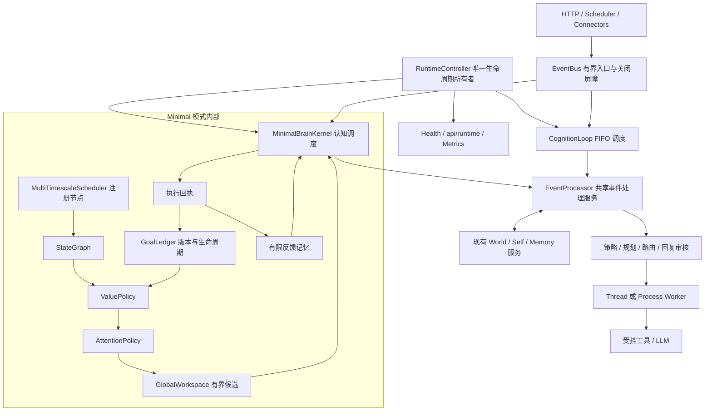

# EVA 运行架构重构 v0.2

状态：已实现的工程架构。本文说明本轮跨执行服务、认知调度、生命周期、入口和恢复的重构；不代表研究文档里的全部认知能力已经实现。

## 统一结构



FIFO 和 Minimal 是可选择的两个消费者，实现中只启动其中一个。两者调用同一个 `EventProcessor`；Minimal 不再调用一个未启动的旧循环来执行任务。MVSC 仍是独立的可选研究扩展，与 Minimal 互斥。

## 责任与扩展契约

| 层 | 代码入口 | 责任 |
| --- | --- | --- |
| 应用组合 | `app/bootstrap.py`、`app/container.py` | 构造并注入依赖，选择消费者，配置关闭步骤 |
| 生命周期 | `runtime/controller.py` | 一次启动、封锁入口、停止生产者与消费者、确认执行空闲、持久化、释放资源、失败重试 |
| 事件处理 | `core/event_processor.py` | 处理一个事件，保留策略、路由、审核、记忆来源与结果投递逻辑；不消费队列 |
| FIFO 调度 | `core/cognition_loop.py` | 消费与确认事件、管理消费线程；保留旧构造方式和读取接口 |
| 认知调度 | `packages/minimal_brain/kernel.py` | 拥有认知状态，组织节点、工作空间与执行槽，整合反馈 |
| 节点期限 | `packages/minimal_brain/scheduler.py` | 注册节点、独立期限、实际 elapsed、超期合并、节点故障观测 |
| 决策组件 | `packages/minimal_brain/policies.py` | 可注入价值评分与注意力选择，有界且经过验证的候选集合 |
| 目标状态 | `packages/minimal_brain/goals.py` | 不可变目标记录、合法状态转移、版本检查、恢复中断 |
| 接口适配 | `app/api_routes/admission.py` | 统一入队、关闭拒绝、消费者故障拒绝、容量错误 |

增加快节点时使用 `PeriodicNode` 和 `kernel.register_node()`，不改内核主循环。每个回调收到实际时间差，错过的周期计入观测而不连续补跑。普通节点故障会被记录，关键节点故障停止协调器；失败回调已经做出的局部修改不会自动回滚。回调必须快速返回，模型和数据库 I/O 继续放进独立的有界执行槽。

`ValuePolicy.score()` 返回有限的工程评分，`AttentionPolicy.select()` 从已接纳事件中选择唯一标识。工作空间拒绝 NaN、重复项、额外事件和超容量结果；最终派发仍检查目标版本与执行容量。这些策略不能增加工具权限。扩展是进程内可信 Python 代码，不是隔离插件沙箱。

目标记录区分 queued/running/completed/failed/cancelled/expired/interrupted。已运行目标不能通过队列取消接口伪装成动作已撤销；完成仅表示该事件处理的成功回执。

## 生命周期与失败语义

启动构造期间用回收栈登记已经创建的资源；组件工厂在返回前失败时也负责释放自己尚未移交的存储。容器和 Controller 组装成功后移交所有权，正常关闭不重复回收。清理错误被记录，并保留原始启动异常。

向量索引重建延后到生命周期所有权建立后，提交现有 worker 执行并跟踪完成；不再从内存工厂启动无法追踪的后台线程。它与其他辅助任务共享执行资源，Minimal 模式的保守容量门控可能因此暂缓后续事件。

正常关闭顺序：

```text
关闭 EventBus 发布入口
→ 请求消费者和处理服务停止
→ 停止连接器、MVSC、定时任务
→ 等待消费者和实际 worker 工作结束
→ 给剩余排队请求失败回执
→ 保存会话、索引和完整快照
→ 关闭存储
```

`RuntimeController` 记录已经完成的关闭步骤。生产者返回未停止、底层任务仍在运行，或保存失败时，关闭状态保持 incomplete；后续依赖不会被继续关闭。重试跳过已成功的步骤，因此快照写失败后重试不会重复回写已完成的会话记忆。

Thread worker 跟踪真实 Future；Process worker 同时跟踪隔离任务与 Core 辅助线程。调用者超时不等于执行空闲。定时器也跟踪正在执行的快照任务，停止调度不等于这些任务已经退出。

`EventBus.close()` 等待已经入场的同步 S5 写完成，再禁止后续入队和持久化。因此它没有严格的耗时上界；Controller 的 timeout 约束消费者等待，不是整个关闭过程的硬截止时间。工具自行启动且脱离所跟踪 Future 的后台工作仍不受该完成判定覆盖。

## 运行与观测

默认继续使用 FIFO 消费者；启用认知调度：

```powershell
$env:EVA_ENABLE_MINIMAL_BRAIN = "true"
$env:EVA_ENABLE_MVSC_PIPELINE = "false"
python -m uvicorn app.main:app --host 127.0.0.1 --port 8000
```

新增 `GET /api/runtime`，同时在 `/metrics` 的 `runtime` 字段提供相同的运行观测：

- 实际选择的 mode、phase、是否接受事件、消费者存活、执行是否空闲。
- 入口队列、处理服务、消费者与 worker 统计。
- Minimal 模式下各节点的运行次数、实际时间差、迟到、跳过周期、故障和等待容量状态。
- 已完成的关闭步骤、失败步骤与等待收尾的请求数。

Prometheus 增加 `eva_runtime_running`、`eva_runtime_accepting_events`、`eva_runtime_execution_idle`。健康检查使用选中的 Controller；旧的 ready=true 标志不能掩盖已死亡的消费者。

三个聊天入口、GitHub webhook 和手动维护入口均处理 HTTP 503，错误码区分 `runtime_stopping`、`runtime_unavailable`、`event_queue_full`。被拒绝的 GitHub delivery ID 不会提前记成已处理。

`/health/recover` 重建快照使用正常保存流程，保留 World/Self/Persona/Memory/Minimal 的完整快照字段。快照依然不是跨所有服务的原子事务，也不提供外部动作的恰好一次执行保证。

## 验收与范围

```powershell
python -m pytest -q
python -m ruff check .
python -m packages.minimal_brain.demo --output artifacts/minimal-brain-demo.json
python scripts/preflight.py
```

回归覆盖正常聊天与证据来源、线程超时后的真实占用、独立节点进展、可替换策略影响派发、非法工作空间与过期目标、入口关闭竞态、失败关闭重试、快照字段保留和实际消费者故障观测。测试使用模拟模型、受控线程与临时存储。

世界、人格与长期记忆继续使用现有服务；并发读取投影不是全局一致性快照。传统多消费线程模式仍有部分运行投影采用最后写入覆盖的语义。本次没有实现并发规划审核网络、信念概率校准、自主学习、自修改代码或分布式运行，也没有据此声称推理能力已经提高。

相关契约：[事件处理服务](event-processing.md)、[Minimal Brain](minimal-brain-v01.md)、[模块边界](architecture-boundaries.md)。
