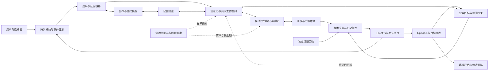

# EVA 来源复核、项目评审与开发计划 v3

评审日期：2026-09-11 至 2026-09-12。状态：**当前实现评审 + 后续开发建议**。

本文的优先级与阶段顺序取代 v2 计划中的固定周次和 Immediate Backlog。这里的待办不代表已经实现；当前运行契约仍以代码、测试及 [Runtime Refactor v0.2](runtime-refactor-v02.md) 为准。

执行更新（2026-09-13）：[RST-01](world-restore-rst01.md)、[RST-02](world-recovery-rst02.md)、[EVD-01](world-provenance-evd01.md)、[EVT-00](request-receipts-evt00.md)、[BASE-02](runtime-baseline-base02.md) 及 [EVT-01](versioned-events-evt01.md) 均已交付代码与隔离验证，覆盖恢复、来源和进程内请求终态。**P0 及 EVT-01 已完成本轮代码与隔离验证；下一批为 STA-01：状态 revision、StateDelta 与过时更新拒绝。** 下面 F01–F06 的问题与采样保留为修复前评审基线。历史启动测试曾写入默认数据目录，已修复测试隔离，并恢复备份覆盖的改动；此前“运行数据未被写回”的说明已更正，详细范围见 RST-02。

## 1. 核心判断

EVA 已有可以继续演进的运行基础：统一生命周期、独立事件处理服务、工具与 Agent 边界、分层记忆、世界图、可选进程后端，以及具备独立周期调度和状态调制的 Minimal Brain 原型。

但来源文档要求的完整认知闭环尚未形成。S4 来源断链已由 EVD-01 修复，仍缺少历史断言和证据核验。其他主要差距是：**事件处理完成没有连接到业务目标达成，候选排序没有形成完整的证据工作空间，经验记录没有经过行为改进验证。** 初次接口采样的运行状态是 `legacy` 消费器；存在 Minimal Brain 代码不等于网页服务已经运行它，后续代码交付也不等于已重启运行实例。

建议保留现有运行基础，以“可靠状态与证据 → 目标和行动闭环 → 有预算的并发认知 → 经验证的学习”为开发主线。恢复、来源和进程内回执基础已交付；完成接线与基线核对后，再进入耐久事件/证据和业务目标闭环。

本文没有验证生物真实性、主观体验或通用智能能力。来源中的脑区类比、激活公式和示例概率被视为工程假设与设计输入。

## 2. 来源重新理解

本次重读用户提供的全部 13 份附件，共 128,760 个字符，并纳入会话中“并行、循环、异步、多时间尺度、互相调制”的修正。下面标题为评审时使用的主题标签，不冒充附件原名。附件标识、字符数、行数与 SHA-256 保存在 [复核证据清单](../artifacts/source-review-2026-09-11.json)。

| 来源 | 主题 | 应转化为的工程要求 |
| --- | --- | --- |
| S01 | 认知架构基础与 Transformer 边界 | LLM 可替换；身体、状态、记忆、目标、执行的生命周期由运行系统掌握 |
| S02 | 并行循环与多时间尺度 | 慢推理不阻塞快状态；局部交流与全局共享并存；循环有衰减、预算和停止条件 |
| S03 | 数值状态与资源竞争 | 物理资源、认知状态、世界状态、自我模型分别建模；未知不被反复推理升级成事实 |
| S04 | Cognitive Dynamics v1 | 状态变化必须改变可观察行为；调制有作用对象、时间尺度、边界与反馈 |
| S05 | Cognitive Kernel v0.1 | State、Node、Edge、Event、Workspace、Episode 有明确契约；不同成本的计算分级调度 |
| S06 | State Graph | 拓扑、延迟、兴奋/抑制、增益、衰减可观测；状态图不代替世界事实图 |
| S07 | Self / World / Memory | 现实观察、用户转述、内部模型、记忆、模拟分开；记录来源、时间、证据与适用范围 |
| S08 | Belief System | 保留支持、反对、替代解释与未知；重复来源不能当成独立证据；必要时先求证 |
| S09 | Goal / Value / Drive | 目标有期望状态、成功条件、依赖和生命周期；价值比较与权限约束分开 |
| S10 | Planner / Simulation / Decision | 结构化候选方案、前置条件、成本、可逆性、模拟分支、执行前复核与局部重规划 |
| S11 | Learning System | 经历通过结果、归因、更新和独立验证改变后续行为；保存记忆本身不算学习成功 |
| S12 | Self-Modification / Evolution | 候选变更与稳定版本隔离；回归、基线、灰度、审计和回滚先于自动修改 |
| S13 | 总图 v1 与收束 | 先验收八部分 Minimal Brain 最小闭环，再扩展信念、模拟、学习等能力 |

会话补充修正：三维排布本身不能推出并发网络的计算性质；应关注连接、时序、反馈与资源竞争。所谓“互相调制”不能让压力或情绪分数自动扩大访问权限。

### 2.1 需要保留的设计原则

1. **模块同时存在，按需发生作用。** 持续运行不意味着每个模块每一轮都调用 LLM。
2. **状态具有实际作用。** 压力、置信状态或目标紧迫性改变选择、预算、阈值或策略，并能从记录解释这个变化。
3. **知识具有来源和范围。** “用户说服务正常”“监控在某时刻报告正常”“模型猜测正常”是不同记录。
4. **行动回到状态和目标。** 工具结果需要更新已知状态，并由成功条件判断目标是否达成。
5. **学习需要外部于更新规则的验收。** 更新后的策略必须在未用于调参的任务上比较收益、代价和退化。

### 2.2 需要收紧的前提

| 原始表达容易造成的误解 | 本项目采用的修正 |
| --- | --- |
| 有这些模块就更接近人脑、必然更智能 | 只能确认实现某些功能结构；是否改善任务表现，需要与简单基线比较 |
| 每个认知模块都应该有独立 OS 进程 | 独立周期和执行隔离是目标；便宜节点可共用调度器，阻塞或高风险工作再隔离 |
| 不能有统一时钟，也不能有任何顺序链 | 公共单调时钟可以支持不同截止期；一次事务和有因果依赖的步骤仍需要顺序 |
| 最大激活值就是最优决策 | 激活优先级、事实置信度、方案效用、权限许可是四种不同量 |
| 动态连接权重已经代表学习 | 临时增益变化是调制；持久权重更新还需数据、归因、验证与版本管理 |
| 所有内容放进统一图就完成统一认知 | 先统一标识、来源、版本与引用语义；物理存储可继续分开 |
| 给信念写上 0.8 就是概率推断 | 没有定义事件空间和校准方法时，它只是启发式评分；应允许未知值 |
| 记录预测误差就形成世界模型学习 | 误差必须对应可验证的预测对象、观察时间与结果尺度 |
| 情绪能修改访问权限 | 调制可降低行为倾向或预算；权限扩大必须来自独立授权机制 |

这些修正允许 EVA 保留并发循环的方向，同时避免用复杂命名替代机制验收。

## 3. 当前项目结构与运行关系

| 区域 | 当前职责 | 后续处置 |
| --- | --- | --- |
| [app](../app/) | FastAPI、组件装配、配置、API、生命周期接入 | 保留装配入口；继续注入依赖，减少兼容属性调用 |
| [runtime](../runtime/) | RuntimeController、线程/进程工作后端、调度、健康、结果注册、WebSocket | 保留；强化持久回执、资源隔离、恢复与可观测性 |
| [event](../event/) | 事件模型、有界内存队列、S5 尽力持久化 | 演进版本化事件与耐久接纳语义，避免另建竞争队列 |
| [core](../core/) | EventProcessor、FIFO 消费器、路由式 Planner、上下文、策略、工具、回复审查 | 按业务契约分离结果整合等职责，继续共享执行入口 |
| [agent_os](../agent_os/) 与 [agents](../agents/) | Agent 注册、选择、执行与结果 | 保留；规划并发不等于允许重复执行副作用 |
| [memory](../memory/) 与 [migrations](../migrations/) | S1–S5、来源标签、检索、压缩、持久存储 | 扩展现有存储契约；先修复语义和迁移，再增加检索后端 |
| [world](../world/) 与 [persona](../persona/) | 世界实体关系、快照、人格/自我配置 | 明确版本所有权、断言来源与经验性能力记录 |
| [connectors/github](../connectors/github/) | GitHub 规范化、轮询、Webhook | 先确保可靠接纳、去重与回执，再扩大连接器范围 |
| [packages/minimal_brain](../packages/minimal_brain/) | 独立周期调度、StateGraph、候选排序、事件目标记录、反馈摘要 | 作为并发认知演进试验入口，达到行为门槛后逐步转入稳定接口 |
| [packages/kernel](../packages/kernel/)、[cognition](../packages/cognition/)、[models](../packages/models/)、[agentos](../packages/agentos/) 等 | MVSC 的事件日志、状态契约、工作空间、DAG、能力模型、验证与治理原型 | 按组件评审后复用，避免整体并入形成第二权威状态系统 |
| [ui/web](../ui/web/) | 聊天、状态面板、记忆浏览、设置、MVSC 页面 | 显示实际运行模式、来源与目标证据；视觉网络图不能替代运行数据 |
| [infra](../infra/) | VM、主机网络、备份恢复等配置与脚本 | 属于部署资产；文件存在不代表当前 Windows 服务已受 VM 隔离 |
| [tests](../tests/) 与 [scripts](../scripts/) | 单元/集成测试、预检、基准与负载工具 | 增加跨层不变量、故障恢复、任务质量与对照实验 |

### 3.1 已核实的消费路径

当前装配由 [bootstrap](../app/bootstrap.py) 选择 `legacy` 或 `minimal` 消费器，再交给 [RuntimeController](../runtime/controller.py) 管理。两者共享 [EventProcessor](../core/event_processor.py)。这是可保留的核心边界。

本次只读 `/api/runtime` 返回 `mode=legacy`、`phase=running`、`accepting_events=true`、`consumer_running=true`，工作后端为 `thread`。这是采样时状态，不承诺之后始终不变。

[配置](../app/config.py) 中 Minimal Brain 与 MVSC 默认关闭且互斥。MVSC 的 [integrate_mvsc](../packages/kernel/mvsc_bootstrap.py) 会构造并挂载实验组件；但当前生产装配的消费器选择没有 MVSC 分支，本次搜索也未发现生产消费路径调用 `run_once_and_sync`。因此不能依据该文件中“替代 CognitionLoop”的描述认定开启开关后已切换到 MVSC 循环。后续应增加从 HTTP 输入到实际消费者的接线测试并纠正文档。

### 3.2 三种图应分开

| 图 | 对象 | 更新依据 |
| --- | --- | --- |
| State Graph | 激活度、压力、阈值、调制、时间常数 | 测量、调度和有界状态转移 |
| World / Evidence Graph | 实体、时间化断言、观察、来源与证据 | 真实观察、用户陈述、带来源的推断及修订 |
| Goal / Plan Graph | 目标、依赖、行动、成功条件 | 用户意图、策略约束与执行回执 |

统一它们的 ID、版本、引用和时间语义；不要把“注意力 0.8”“服务器健康”“部署步骤完成”混成同一种边。

## 4. 来源要求与实现差距

这里的“已有”只描述表中限定行为，不代表整个理论模块完成。

| 能力 | 当前证据 | 判定与缺口 |
| --- | --- | --- |
| 生命周期、停止、资源所有权 | [controller](../runtime/controller.py)、[bootstrap](../app/bootstrap.py)，本次相关测试通过 | 已有；全流程硬截止时间和所有操作的强制终止并未由这些契约保证 |
| 独立周期与慢调用隔离 | [scheduler](../packages/minimal_brain/scheduler.py)、[kernel](../packages/minimal_brain/kernel.py) | Minimal 原型已有；便宜回调仍共用协调线程，慢回调可拖延其他节点 |
| 循环状态与动态调制 | [state_graph](../packages/minimal_brain/state_graph.py) | 有延迟、衰减、来源版本和有时限增益；没有经过任务数据验证的权重学习 |
| 数字身体 | Minimal `resource_probe`、kernel 的 pressure | 使用队列/运行资源信息构造压力；不代表生理情绪、能量或完整资源感知 |
| 全局工作空间 | [policies](../packages/minimal_brain/policies.py) | 目前主要选择已接纳事件 ID；事实、记忆、约束、候选计划的共同工作空间未贯通 |
| 注意力与价值 | 可替换 ValuePolicy / AttentionPolicy | 已有工程排序；无目标效用校准、全局 token 预算或多方案决策证明 |
| 目标系统 | [GoalLedger](../packages/minimal_brain/goals.py) | 完成条件是处理器成功回执；缺期望世界状态、业务成功判定、子目标与持久恢复 |
| 世界模型 | [WorldModelGraph](../world/world_model.py) | 实体关系模型已有；恢复不幂等，字段级来源与有效时间不足 |
| 自我模型 | [persona](../persona/)、[MVSC SelfModel](../packages/models/self_model.py) | 配置与能力记录原型已有；固定加减置信度不是任务分层校准 |
| 分层记忆 | [tiered_store](../memory/tiered_store.py)、[provenance](../memory/provenance.py) | S1–S4 已有来源标签，S4 保留当前字段来源；历史断言与证据核验仍待实现。S1–S5 是存储分层，不等于 S01 提出的五类心理记忆 |
| 信念与证据更新 | provenance、结构化 Claim、MVSC 部分 confidence 字段 | 有基础材料；没有接入稳定执行路径的完整支持/反对/依赖证据更新机制 |
| 规划 | [core Planner](../core/planner.py)、[MVSC PlannerDAG](../packages/agentos/planner_dag.py) | 前者以命令/语义/关键词路由为主；后者有模板 DAG，尚不等于多方案搜索、约束满足与可靠重规划 |
| 预测与模拟 | [PredictionTracker](../core/prediction.py)；MVSC 相关模型 | 当前预测误差是词集合相似度差异；没有完成可验证状态预测与独立未来分支模拟 |
| 回复审查 | [response_review](../core/response_review.py) | 检查声明与回执契约，明确 `fact_verified=false`；不能当作独立事实核查器 |
| 学习 | 记忆压缩、预测记录、能力计数、可替换策略 | 有数据积累与更新原型；未看到“候选策略对留出集改善并可回滚”的稳定闭环 |
| 自修改治理 | [governance](../packages/governance/governance.py)、[sandbox](../packages/agentos/sandbox.py) | 有提案、审计和执行沙箱原型；没有完整候选构建、独立评估、发布和回滚链 |
| 耐久日志与回放 | S5、[MVSC EventStore](../packages/kernel/event_store.py) | MVSC 有 append/replay/checkpoint；稳定队列仍尽力持久化。日志哈希一致不证明世界状态重建或副作用恰好一次 |

不建议对以上各项强行给出“完成百分比”：目前没有统一能力分母，也没有覆盖完整来源要求的验收集。

## 5. 优先问题与证据

### F01：世界图恢复产生重复边——已复现，P0

调用链为 `build_world → WorldModelGraph.from_dict(snapshot) → load_from_store(S4)`。`from_dict` 恢复快照中的边，`load_from_store` 又直接追加数据库边，没有按 `(source, target, relation)` 合并。

本次无网络、无持久写入的隔离复现：初始一条边，每次将当前状态保存为字典、恢复，再加载同一条 S4 边，数量依次为 **1、2、3、4**。

只读采样还观察到：

| 数据 | 数值 |
| --- | ---: |
| 最新快照文件大小 | 23,596,358 字节 |
| 快照实体数 | 183 |
| 快照边数 | 102,013 |
| 不同边三元组数量 | 834 |
| 重复边条数 | 101,179 |
| 单个三元组最大重复次数 | 124 |
| S4 实体 / 边数 | 183 / 834 |

快照和数据库在服务运行期间先后读取，不是同一事务快照；数字是采样记录。代码与隔离复现证明恢复不幂等，也能解释所见重复的增长机制；不能仅凭这些数据还原每一次历史重复的具体来源。

关联成本：`link` 线性扫描边，`to_dict` 复制全部边；Minimal [model_probe](../packages/minimal_brain/integration.py) 先调用全图 `to_dict` 再裁剪。输出小并不等于读取成本小。另外恢复查询写死 `limit=5000`，需要明确超过该规模时的分页与完整性。

建议：唯一键索引、幂等合并、恢复权威与版本规则、分页恢复、有限投影 API。历史修复应先备份和生成差异报告，不能直接按数量删除边或用 S4 覆盖可能只存在于快照的更新。本次评审没有修改运行数据。

### F02：推断来源在进入 S4 时丢失——代码证据，P0

[EventProcessor](../core/event_processor.py) 对回复写入 S1–S3 时使用 `ASSISTANT_INFERENCE` 来源；紧接着从同一回复抽取实体，写入世界图时只传类型、名称和 properties，关系只有端点、关系、权重。抽取结果携带的顶层来源/置信信息没有在这条调用链贯通。

[ContextBuilder](../core/context_builder.py) 又将世界图任务显示为 `Active tasks`，没有像记忆文本一样附带来源标记。这形成一条把推断重新包装成普通世界状态的路径。它不证明所有已有实体都错误，但说明当前系统不能逐条证明其可信来源。

建议先保证用户陈述、工具观察、助手推断、模拟结果的标签贯穿 S4、API、上下文和压缩；旧数据降级为未知来源，不能批量标成事实。

### F03：入队成功、持久接纳与完成回执不是同一个保证——代码证据，P0/P1

[EventBus](../event/event_bus.py) 先入队，再尽力写 S5；持久化失败仍可能返回接纳成功。默认 `drop_oldest` 会淘汰已接纳的旧事件，只增加计数，没有给被淘汰请求产生终态回执的钩子。Minimal 的 `drop_newest` 改善入口拒绝，但不自动提供重启恢复。

建议先明确接纳等级与终态责任：交互请求不可被静默淘汰；重复、拒绝、取消、超时、崩溃后的不确定结果都应可查询。随后实现持久 inbox、状态事务和 action outbox。外部系统无法提供幂等接口时，超时必须允许 `outcome_unknown` 和对账，不能以本地日志承诺通用 exactly-once。

### F04：成功语义与学习评价不一致——已核实，P1

GoalLedger 的 `completed` 是“稳定处理器返回成功回执”，不表示文件已符合需求、服务已恢复或用户目标已实现。PredictionTracker 的字符串相似度也不足以评价这些结果。

建议引入明确的 `desired_state / success_predicate / observation_refs / outcome`，分别记录“请求处理结束”“行动返回”“目标已验证”。没有有效观察时，目标应是待验证，而非成功。

### F05：并发原型的行为覆盖仍窄——已核实，P2

Minimal 将慢事件处理和模型投影移出快协调线程，已具备有价值的调度边界。但生产集成只有少量状态节点，候选主要是待处理事件，认知执行槽为一个；`processor_ready` 依赖整个 worker 后端空闲，辅助重建等任务可能延迟交互调度。

建议按认知执行、只读投影、维护分配独立预算和占用指标；首先并发化只读检索、预测和候选审查，再通过版本化提交点汇合。单个协调器可继续掌握状态提交，不需要为了“网络感”允许所有节点任意写共享字典。

### F06：实验资产与当前能力容易混淆——代码/文档差异，P0/P2

MVSC 有可复用的事件契约、DAG、SelfModel 和消融设施，也存在模板实现与基础类空钩子。EventStore 的 `compute_state_hash` 对事件序列序列化求哈希，不能据此断言业务状态重放确定。开启实验开关、构造对象、执行生产请求和通过业务验收应在文档与 UI 中分开显示。

建议先做实验接线和职责清单；通过验证的组件迁入稳定边界，剩余组件保留研究状态。不要把两套事件、世界、权限和记忆系统同时设为权威。

## 6. 目标架构与实施原则

下面是拟议目标结构，不表示当前全部已接入。箭头表示数据、反馈或约束关系；事务内部可以顺序执行。



### 6.1 统一契约，保留不同存储

建议按依赖逐步引入以下对象，而不是一次写完全套 schema：

| 对象 | 最小必要语义 |
| --- | --- |
| EventEnvelope | schema_version、event_id、source、observed_at、received_at、correlation、causation、idempotency_key、deadline |
| Observation / Assertion | subject、predicate、value、scope、epistemic_status、source_event_id、evidence_refs、valid_from/to、revision；confidence 可为空 |
| StateDelta | base_revision、变更字段、来源事件、提交者、时间；过期结果拒绝或显式重算 |
| BusinessGoal | desired_state、success_predicate、constraints、dependencies、commitment、deadline、status、evidence_refs |
| Plan / ActionIntent | goal_id、前置条件、步骤依赖、资源预算、可逆性、授权引用、幂等键、预期结果 |
| ActionReceipt | accepted/started/finished 时间、结果、外部标识、观察引用、outcome_unknown、重试/对账状态 |
| Episode | 前后状态引用、目标、方案、行动回执、结果向量、预测误差、归因假设、策略版本 |
| PolicyCandidate | 原策略版本、训练数据范围、候选参数、留出评估、限制、回滚版本 |

同一条来源可以支持多个断言，但同源转述不能累计成多份独立证据。后续新增标签和版本时，应迁移现有 `memory/provenance.py` 契约，而不是创建不兼容的第二套标签。

### 6.2 并发与预算

保留一个运行生命周期所有者和明确的状态提交所有者。便宜节点按各自周期或事件唤醒，昂贵计算放入有界执行槽；每个结果包含读取版本和截止期。调制包含来源、对象、上下限、TTL、撤销方式和审计记录。

资源预算至少分为并发槽、队列长度、token/调用次数、等待期限和维护份额。先验证压力分数与排队/延迟的关系，再决定它应该怎样影响策略，不能仅凭变量名推断“维护优先”总能减压。

反馈只更新状态或产生有预算的认知工作；重新发出外部行动必须生成新 ActionIntent 并经过提交检查。过时的规划、审查、模拟不能覆盖已经改变的目标或授权。

### 6.3 现有代码复用决策

- 保留 RuntimeController、EventProcessor、注册/路由/工具执行边界、现有存储适配器和迁移机制。
- Minimal Brain 继续作为可选消费者；先补完整验收，再决定是否切换默认模式。
- MVSC EventEnvelope/EventStore、PlannerDAG、ActionReceipt、SelfModel、消融框架逐项评估复用；先适配单一权威存储与生产入口，再谈整体迁移。
- `core/planner.py` 短期继续承担路由职责，新增业务规划应有独立清晰契约；避免仅通过改名宣称已有规划能力。
- VM、分布式代理、多模态感官、更大图数据库与自动代码进化按真实需求进入后续阶段。当前没有证据证明它们是解决上述缺口的前置条件。

## 7. 分阶段开发计划

以下优先级是评审建议。周期是单名熟悉代码的开发者、保持当前本地部署范围时的粗略估算，不是日历承诺；通过第一阶段复核工作量后再排具体日期。每个阶段都有可交付物和退出条件，未通过不按时间自动进入下一阶段。

| 阶段 | 目标 | 工作量初估 | 依赖与退出条件 |
| --- | --- | --- | --- |
| P0 | 修复恢复与来源断链，建立可信基线 | 1–2 个开发周 | 无新增能力依赖；重复恢复不增长、来源不升级、接纳失败有回执 |
| P1 | 统一事件/证据/状态与行动持久语义 | 2–3 个开发周 | P0；崩溃恢复可解释、重放不执行外部动作、未知结果可对账 |
| P2 | 业务目标、有限规划、并发工作空间 | 3–4 个开发周 | P1；真实目标验收、旧版本结果拒绝、慢任务不拖垮快状态 |
| P3 | 信念、有限模拟、可验证学习 | 3–5 个开发周 | P2 与可用评估集；证据更新可追溯，留出集改善且无关键退化 |
| P4 | 发布与受控演进 | 根据部署目标单独估算 | 前述门槛及部署需求；恢复/隔离/灰度/回滚演练通过 |

工作项数量与探索成本仍有不确定性，不能将该表直接解释为“在这些周数后完整实现人脑式 AI”。

### P0：可靠性与语义基线

| 编号 | 具体工作与主要位置 | 交付/验收 |
| --- | --- | --- |
| RST-01 | 修正 `world/world_model.py` 与 `app/composition.py` 的恢复合并；明确边唯一键、冲突优先级、分页和快照格式 | 同一数据反复恢复得到相同规范状态；快照/S4 重叠、不同版本、超过 5,000 条的用例覆盖 |
| RST-02 | 历史重复诊断与迁移；给 world 增加 bounded projection / counters，替换 Minimal 的全图复制 | dry-run 报告、备份、恢复验证；保留所有不同断言，不按重复次数推定证据强度；测量投影耗时与分配量 |
| EVD-01 | S4 实体/关系来源与上下文标注，修改 EventProcessor、WorldModelStore、ContextBuilder 及相应 API | 同一助手推断经过记忆、图、摘要、再次检索后仍是推断；旧记录为 unknown；模拟不进入观察事实 |
| EVT-00 | 明确队列满、淘汰、超时与关闭的终态责任；优先保护已接纳交互请求 | 每个接纳的测试请求均有可查询终态；负载测试不出现无记录消失 |
| BASE-02 | 记录默认/Minimal/MVSC 的实际接线，更新 UI 模式标识和文档；固定离线评估数据与运行配置 | HTTP 到消费者接线测试；界面显示实际模式；形成延迟、内存、队列年龄基线 |

本阶段先建立失败用例再修复对应机制。历史数据迁移应在离线副本上验证；正在运行的服务不能与迁移脚本并发写同一份快照。

### P1：证据、状态与行动可恢复

| 编号 | 工作 | 交付/验收 |
| --- | --- | --- |
| EVT-01 | 统一版本事件契约，评估复用 MVSC envelope；规范化现有 user/time/GitHub 事件 | 老格式适配与迁移；未知版本拒绝；同一来源事件拥有稳定标识 |
| STA-01 | 为世界/认知投影建立版本化 StateDelta 和提交规则 | 过时更新不覆盖新状态；读模型带 revision；定义跨存储一致性边界 |
| EVT-02 | 持久 inbox + 处理状态 + 行动 outbox；外部动作执行与结果记录分开 | 注入“已接纳未消费、已提交未执行、已执行未记回执”故障；恢复可查询，未知结果进入对账 |
| EVD-02 | 时间化 Assertion、来源引用和撤销/被取代语义 | 新旧观察冲突可追溯；过期信息不冒充当前事实；用户陈述与工具观察并存 |
| EPI-01 | Episode 记录前后状态引用、策略版本、动作与结果向量 | 一次处理可追溯到原始事件和回执；回放只重建状态，不重新调用 LLM/工具 |

优先沿用当前数据库和迁移能力。日志、状态提交和 outbox 在同一存储边界内使用事务；跨数据库或外部系统的状态以明确的一致性/补偿协议处理。回放需记录非确定输入、时钟与实际模型结果，不能重新采样 LLM 后要求输出一致。

### P2：从处理事件到完成目标

| 编号 | 工作 | 交付/验收 |
| --- | --- | --- |
| GOL-01 | BusinessGoal 与现有 handle_event 记录分开；实现成功谓词、依赖、挂起、取消、失败和待验证 | 请求已回复但目标未完成的场景保持未完成；目标重启后可恢复且不会自动重复危险动作 |
| PLN-01 | 一个受限领域的结构化 Plan/Step，复用并校正模板 DAG | 先支持只读诊断或项目检查；前置条件、依赖、预算、局部失败和重规划均可检查 |
| WRKSP-01 | 工作空间接纳证据、约束、目标和方案引用；只读检索/预测/审查可并发 | 多类型项目有来源和有效期；限制 token/条目数；保留相反证据；结果合并检查目标和状态版本 |
| DYN-01 | 节点运行预算、滞回、TTL、调制审计与工作槽分类 | 慢推理时快节点持续推进；重复信号不会放大成无限行动；辅助维护不无限阻塞交互 |
| UI-01 | 展示业务目标、成功证据、计划/回执、运行模式、队列等待和来源 | “处理完成”“执行完成”“目标已验证”三种状态可区分；未采样或未实现的值显示未知 |
| EXP-02 | legacy/Minimal 相同任务集、相同模型配置和预算比较 | 质量、延迟、成本、噪声、失败恢复达门槛后才提出默认模式切换 |

P2 的代表性交付：用户要求检查某项目是否满足一组可机器验证条件；EVA 创建目标，检索必要资料，生成有限计划，执行只读检查，依据真实回执标记通过/失败/未知。处理中改变目标或提供新证据时，旧计划不会直接提交。

### P3：信念、模拟和学习

| 编号 | 工作 | 交付/验收 |
| --- | --- | --- |
| BLF-01 | 支持/反对证据、替代解释、同源分组、置信缺失与过期语义 | 重复转述不增加独立证据数；新增反证改变结论或触发求证；未知不强制数值化 |
| SIM-01 | 面向限定任务的独立分支模拟，标注假设、读取版本和预测对象 | 模拟无外部副作用，不污染 World 观察层；超过预算停止；记录预测与后续实际观察 |
| MET-01 | 把 PredictionTracker 的文本差异与任务结果指标分开 | 分别评价完成率、延迟、成本、观察误差；中文改写不被误当成任务失败 |
| LRN-01 | 从 Episode 离线生成候选排序/检索策略；参数版本化 | 训练/验证/留出数据分开；与固定基线比较；改善不足或重要退化则不晋升 |
| MOD-01 | 仅对已验证参数做受控调制/更新，保留撤销 | 调制过期恢复；异常输入、状态漂移触发回退；权限规则不会被学习过程修改 |

本阶段只为有稳定评价目标的任务定义概率校准。启发式分数继续叫分数；有足够独立标签、明确预测事件时，才增加 Brier score 等概率指标。不能用模型自评作为唯一“学会”的证据。

### P4：发布和受控演进

先根据实际部署范围选择工作。若要开放高权限代码/文件工具，原 v2 的 WRK-03/WRK-04 必须在开放前完成：验证 Windows Job Object 或目标平台等价限制、子进程清理、授权工具代理与资源故障恢复。它们不因路线图排序而被取消。

其余交付包括版本化备份恢复、快照/数据库升级回退、24 小时运行试验、平台验证、连接器 checkpoint、proactive outbox、可观察 SLO 与发布制品。多 API 进程上线前，需要共享耐久事件/结果存储与调度唯一所有者。

自修改从候选配置开始：提案 → 隔离评估 → 与原始基线及当前版本比较 → 有限灰度 → 观察 → 晋升或回滚。代码层自动修改与自动发布列为独立研究/产品决策；现阶段不将“批准了一个提案”视为具备自进化。

## 8. 验收应验证什么

下列数字是**拟议实验配置**，不是本次已完成的性能结果。先以当前硬件、固定数据和模型配置建立基线，再确定延迟/质量阈值。

| 场景 | 对照/操作 | 必须成立的性质 |
| --- | --- | --- |
| 恢复幂等 | 同一图进行 100 次保存/恢复/S4 合并 | 不同边、属性、来源与规范状态哈希稳定；文件大小不随重复恢复线性增长 |
| 恢复完整性 | 图规模超过当前 5,000 条读取上限 | 分页恢复完整，或者显式拒绝不完整恢复；不悄悄丢失 |
| 来源不升级 | 助手推断经过 S2/S3/S4、摘要和下一轮上下文 | 仍能追到原始推断；未因重复或压缩变成 verified_fact |
| 并发有效 | 用固定 3 秒慢处理占据认知槽，插入资源与新事件更新 | 快节点持续运行，记录 lateness/跳过周期；没有额外副作用重复执行 |
| 目标真实 | LLM 声称成功，但工具检查失败或无结果 | 业务目标仍失败/待验证；事件处理成功不覆盖目标状态 |
| 过时结果 | 规划时修改目标 revision 或撤销授权 | 旧结果不能直接提交行动，必须重新检查 |
| 崩溃窗口 | 分别在接纳、提交、执行、回执阶段中断 | 重启后状态可解释；重复动作由幂等或对账处理 |
| 循环稳定 | 重复反馈、延迟乱序、过载、节点失效 | 容量、调用预算和历史有界；无自激式无限任务生成 |
| 学习收益 | 候选策略与冻结基线跑同一留出集 | 使用独立可核验结果；同时报告质量、成本和退化，不只报告平均分 |

把“工程契约成立”“任务效果改善”“长期稳定”分开报告。没有某项测量时写未测量，不能用测试数量代替效果证据。

## 9. 下一次开发的具体入口

2026-09-25 执行补充：GOL-01 参考 ledger 已修复直接转换为 completed 的条件
绕过、非法观察部分写入、批量恢复部分提交，并补充进程内并发版本检查、状态
revision 检查和显式到期处理。详见 [GOL-01 契约与边界](business-goals-gol01.md)。
同日后续开发已增加默认关闭的 SQLite 目标表、服务器终态回执适配、认证 HTTP
登记/查询/取消接口和生命周期接线；legacy/Minimal 均覆盖“已回复但目标未验证”
以及实际启动—停机—恢复的隔离端到端测试。数据库写失败可从尚在保留期内的
权威回执补记；跨组件崩溃窗口仍不提供无损回执保证。运行实例尚未启用此功能。
后续增量已接入限定领域的 workspace_files_sha256_v1 只读验证器：预期文件与哈希
在创建目标时固定，实测结果绑定目标版本、源事件与检查器版本；取消/过期/旧版本
不提交成功。它仅证明指定字节在采样时匹配，不证明代码质量或动作因果。2026-09-27
已接入目标证据粒子图谱，展示回执、成功条件和最近 5 次检查，支持目标分页、搜索、
节点详情和局部探索。图谱接口为独立只读快照，不触发对账/过期/文件检查。仍不能把处理器 succeeded 当作
业务目标 completed，也不能把文件检查扩展宣称为通用业务事实核验。

2026-10-01 已接入目标登记表单：绑定已有 task_id、固定文件哈希条件和可选截止时间；
不自动执行或验证。超时/冲突/服务错误后显式查询已登记结果，成功后按目标 ID 刷新并
选择真实图谱节点。页面内保留草稿与提交锁，重载后需使用原请求 ID 先查询。
同日已接入 Episode/目标证据的只读引用：同库来源事件与行/记录身份严格匹配，
有界 E 节点展示状态 revision 和动作回执引用；缺失/异常记录不补造节点，读取不重放
动作、不推进目标。同库之外的独立记录不隐式合并。同日已接入默认关闭的
`EVA_ENABLE_PROCESSING_EPISODES`：共享处理器执行前写草稿、按首个终态封存，
真实子进程骤停后恢复为未知并阻止同一事件重放。v2 保存实际世界快照哈希，版本
明确未知；只记录 agent 调用，不补造逐工具收据。legacy/Minimal 接口与关闭边界
已有隔离回归，详见 [EPI-01](episode-records-epi01.md)。
已继续接入 Episode 到目标的事务通知 outbox：封存/最小终态/待送通知原子提交，
目标提交后确认前骤停可幂等补送；Episode 提交失败时，恢复可核对目标库已存的
服务器回执。消费者启动前补送，再执行目标中断恢复，不重做动作。既有目标显式
对账可读取耐久摘要，但摘要不恢复聊天正文或接纳新请求。
已继续接入线程内工具注册表/Executor 的耐久调用收据：参数哈希、父动作、真实
返回观察与未返回的未知封存记录进入 Episode/图谱；同一 Episode 的未知同参
调用禁止重复执行。普通/流式 ChatAgent、嵌套 Executor 与文件写入后进程骤停
已有隔离测试；不把处理器返回成功当作外部状态认证。
已继续接入 [REC-01](tool-reconciliation-rec01.md)：文件 Executor 写入前固定路径与
预期哈希，未知结果可通过认证接口追加独立文件状态观察；图谱提供显式核验与
只读历史。原始收据、Episode 和目标状态不改变，不解除未知调用重试限制。
实际文件写入后的进程骤停与双连接观察竞争已有隔离测试，远程副作用仍未对账。
已继续实现 [ACT-01](state-action-transactions-act01.md)：SQLite 状态/事件/行动意图
原子提交、领取凭证和未知恢复，接入显式 MVSC 循环；反馈提交失败不重做动作。
后续 [ACT-02](durable-requests-act02.md) 已将独立请求派发账本接入实际 legacy/Minimal
HTTP 消费者：耐久接纳、状态/源事件/意图/领取原子提交、首个完整回执保存、重启
查询和目标摘要补送；默认关闭，未领取请求恢复为未执行，已领取缺失终态恢复为未知，
没有重放。世界/记忆与远程副作用仍在事务之外；不得算作全项目事务化或线上已启用。
后续 [ACT-03](unclaimed-request-recovery-act03.md) 已接入默认关闭的未领取请求
恢复发布器、原期限/当前策略复查、Minimal 精确快照去重协调及待处理业务目标关联。
真实 HTTP 接纳后的领取前崩溃可继续原任务；领取后和已产生副作用的崩溃均不重做。
后续 [ACT-04](action-context-bindings-act04.md) 已接入实际世界上下文的实例 scope/revision、
S2/S3 SQLite 原事务版本与固定快照检索、逐项记忆 ID/哈希，以及实际 Agent 调用前
的上下文/子行动意图/派发 revision 原子提交。Episode 引用同一 Agent action ID；
领取后中断仍保留未知并禁止重做。世界/记忆尚未搬入该行动事务，粒子输入连接仍待接入。
下一批建议：接入图谱行动—输入连接，推进世界/记忆的耐久状态提交，再补充补偿
协议和远程工具独立对账，补齐直接 Agent I/O 与跨进程工具入口；生产切换和真实外部服务
副作用崩溃窗口仍需单独演练。
版本保护的检查/取消交互和检查历史分页已接入。启动部署和真实浏览器验收须单独验证，
当前服务未启用目标功能或本轮处理记录开关。

根据用户新增的 Obsidian 集成与粒子记忆图谱需求，已插入并完成 [OBS-01](obsidian-memory-graph.md)：首页改为真实记忆的有界关系图，增加来源节点、单向 Markdown 镜像、手工修改冲突保护和只读预览。没有将这一展示层交付计作 State Graph 动力学或双向笔记同步。悬空世界关系的清理需要独立来源检查；原 STA-01 顺序继续保留。

RST-01、RST-02、EVD-01、EVT-00、BASE-02、EVT-01 已完成代码及隔离演练。EVT-01 已交付共享 v1 信封、老事件适配、未知版本拒绝、来源标识和入队快照，并在新副本补齐及读回验证 12,973 条历史事件。**STA-01 已完成**：`ConsciousState.version`、`StateDelta`、原子提交、过时 revision 拒绝、完整性校验和并发回归已落地，详见 [state-revision-sta01.md](state-revision-sta01.md)。**EVT-02 的可执行参考实现已完成**：SQLite 持久 inbox/outbox、幂等去重、lease 回收、失败重试、terminal 状态和可选 EventBus 接入已落地，详见 [persistent-inbox-outbox-evt02.md](persistent-inbox-outbox-evt02.md)。当前生产服务未强制启用该可选队列；跨进程 worker、动作对账和生产切换仍需单独演练。**EVD-02 已完成断言契约**：`TemporalAssertion` 区分观察时间与有效窗口，支持来源引用、撤销、替代、过期和未知版本降级，详见 [temporal-assertions-evd02.md](temporal-assertions-evd02.md)。实体/记忆历史表和 UI 展示仍需后续接入。

**EPI-01 已完成可恢复 Episode 契约及可选处理器接线**：v1 保留状态 revision 契约，v2 自动记录以实际世界快照哈希表达未知版本；处理草稿、首个终态封存、重启未知结果恢复与去重已落地，后续已接入目标通知 outbox 及线程内注册工具/Executor 收据。回放只返回状态引用，不调用外部动作，详见 [episode-records-epi01.md](episode-records-epi01.md)。生产跨组件事务、全部外部执行入口的收据和远程副作用对账仍待完成。**GOL-01 已完成业务目标 ledger 参考实现**：目标依赖、显式成功/失败谓词、待验证状态、取消、版本冲突和重启中断恢复已落地，详见 [business-goals-gol01.md](business-goals-gol01.md)。后续已接入可选持久化、回执、文件检查与只读目标图谱（见本节执行补充）；生产 worker 跨组件事务仍需后续完成。

第一轮结束应交付：

1. 恢复幂等修复及回归结果。
2. 原始备份、重复/冲突 dry-run 报告与可恢复的迁移方案。
3. 世界图有限投影接口及前后读取成本记录。
4. S4 来源契约设计和迁移测试，旧数据未知来源处理规则。
5. 更新后的当前架构、运行模式说明和下一轮任务估算。

上述五项现已由三个交付文档和验证记录覆盖；默认运行数据库未被 EVD-01 迁移演练替换。后续仍按验收结果推进，不根据经过的时间自动标记完成。

## 10. 初次来源评审的验证范围（历史基线）

本次重新执行：

```powershell
python -m pytest -q tests/test_world_model.py tests/test_evidence_governance.py tests/test_runtime_controller.py tests/test_event_bus.py tests/minimal_brain tests/mvsc/test_kernel.py
```

结果：**172 passed in 7.53s**。另外完成纯内存恢复复现、快照/SQLite 只读计数、运行接口只读采样以及来源文件校验清单。

没有在本次重跑全量测试、进行生产压测、调用真实 LLM 进行质量评估或验证 VM/跨平台隔离。定向测试通过并未覆盖 F01 所示组合恢复问题，后续修复需要新增针对该不变量的回归用例。本次只新增评审/证据文档并调整文档入口，保留已有工作区改动。

## 11. UI 与 Logo 专项执行顺序（2026-09-30）

用户确定本次计划范围为当前对话 UI 与 Logo 管理系统。该专项不替代第 7–9 节的核心运行时／认知开发顺序。工作项细节、文件位置、依赖、验收和边界见 [UI 与 Logo 开发实施明细](ui-logo-development-plan.md)。初始计划如下；执行状态见本节末尾。

已有基础包括：真实二阶／三阶状态、合法面转动与日志逆序复原、按请求固定的 normal／deep 模式、统一 Token 与标准几何、品牌工作区、本地显示偏好、同源 SVG／PNG 和品牌交付包。上一轮开发记录为 246 项 JavaScript 测试通过；本次没有重跑。浏览器生成包内容已独立验证，实际浏览器保存、离线页运行及性能仍需分别补证据。

| 批次 | 优先级与工作项 | 交付与退出条件 | 工作量初估 |
| --- | --- | --- | --- |
| M1 稳定性 | P0：UL-01 浏览器／下载／离线验收；UL-02 动效异常恢复 | 实际落盘文件与离线运行通过；故障可静态展示与受控重试；不丢失动作日志或阻断对话 | 3–4 人日 |
| M2 产品体验 | P1：CHAT-01 消息操作与公开状态；DS-01 统一视觉与可访问交互 | 请求模式保持一致；复制／显式重试可用；主题、语言、响应式和键盘验收通过 | 3–4 人日 |
| M3 品牌治理 | P1：BRAND-01 资产版本与来源指纹；BRAND-02 显示配置导入／预览／撤销 | 浏览器与 CLI 版本一致；不导入任意几何或运行参数；资产仍从标准状态生成 | 3–4 人日 |
| M4 性能与交付 | P1：PERF-01 实测与优化；REL-01 发布检查与说明 | 形成设备基线与性能预算；回归、生成资产一致性、最终包与离线验收通过 | 2–3 人日 |

合计 11–15 人日，按一名熟悉代码的开发者顺序执行、保持当前原生前端与 CSS 3D 架构、不新增后端管理服务估算；另可保留 2–3 人日浏览器差异余量。M1 结束后修订估算，验收未通过不按时间自动升级状态。专项 P0／P1 是交付优先级，不改变全项目阶段编号；UL 编号避免与现有目标界面 UI-01 混淆。

**计划初稿入口：UL-01 → UL-02。** 先记录实际下载与离线运行结果，再修复动效异常路径并回归快速切换、隐藏、暂停、减少动态效果及回复结束的组合场景。后续顺序为 CHAT-01 → DS-01 → BRAND-01 → BRAND-02 → PERF-01 → REL-01。最新执行状态以下列日期记录为准；用户新增全界面 THEME-01 已纳入本地交付，原验收门槛保留。

聊天流断开目前不取消已接纳任务。真正的任务取消需独立后端终态契约，不计入此专项估算；界面不能把停止本地接收宣称为服务器已取消。团队资产服务、更多平台图标、框架包装与视频导出也作为后续独立扩展。

2026-09-30 首批执行：UL-02 代码与本地验证已交付，增加独立静态展示、日志核对、呈现器重建与受控重试；260 项 JavaScript 测试和生成资产检查通过。内置浏览器已验证二阶／三阶品牌故障恢复，以及三阶动效故障期间正常接收固定预览回复。UL-01 的实际 Chrome／Edge 保存与离线运行仍未完成；UL-02 的跨浏览器与长期生命周期验收继续保留。M1 不标记完成。详见 [M1 验收记录](ui-logo-m1-acceptance.md)。

2026-09-30 后续执行：在保留 M1 待验收项的同时，推进独立的 CHAT-01 消息功能。完整回答复制、显式重发、原请求查询、结果未知与迟到回执处理已交付；281 项 JavaScript 测试及品牌资产检查通过。内置浏览器验证键盘操作、拒绝后的固定模式重发和流中断后的仅 GET 查询，固定预览不连接真实模型。CHAT-01 待综合验收，M2 未完成。详见 [CHAT-01 验收记录](ui-logo-chat-acceptance.md)。当前开发入口为 DS-01，共享呈现 Token、窄屏紧凑动效和静态 aria 标签翻译；原生 Chrome／Edge 保存、离线运行及长期生命周期证据仍是发布前置门槛。

2026-09-30 DS-01 执行：共享界面 Token、窄屏紧凑魔方、焦点交接、静态 aria 翻译和主题／语言存储容错已接入。品牌逐步动效状态不再作为播报源。287 项 JavaScript 测试、生成资产一致性检查通过；内置浏览器完成聊天／品牌页共 32 组响应式主题语言度量、窄屏长回复与代码复制、折叠后状态保持及故障恢复、标签键盘检查。DS-01 待真实 200% 缩放和辅助技术综合验收，M2 未完成，详见 [DS-01 验收记录](ui-logo-ds01-acceptance.md)。下一开发入口为可独立推进的 BRAND-01 版本与来源指纹；所有 M1／M2 未通过门槛继续保留，不取消 BRAND-02／PERF-01／REL-01。

2026-09-30 BRAND-01 执行：浏览器与 CLI 共享四类版本；规则／几何／Token／源码指纹、每文件 SHA-256、变更记录、生成来源检查和版本递增门槛已交付。298 项 JavaScript 测试及生成资产检查通过；浏览器 69 文件与 CLI 65 文件包已独立解码，版本／来源和公共资产内容一致。页面拒绝未知版本与混合来源，BRAND-01 单项本地验收通过，详见 [BRAND-01 验收记录](ui-logo-brand01-acceptance.md)。当前入口为 BRAND-02 配置导入／差异预览／应用／撤销；M3 未完成，M1／M2 待验收项与 PERF-01／REL-01 保持有效。捕获生成字节仍不作为原生下载或直接离线运行成功的证据。

2026-10-01 BRAND-02 执行：受限显示配置 JSON、严格版本／六字段验证、只读差异预览、合法逆序复原后的应用与单步撤销已交付。314 项 JavaScript 测试及生成资产检查通过；内置浏览器验证二阶／三阶实际 10／14 步逆操作、配置拒绝、文件读取竞态、存储失败、键盘焦点、系统偏好与窄屏四组主题语言布局。BRAND-02 单项本地验收通过，M3 两项本地验收已交付，详见 [BRAND-02 验收记录](ui-logo-brand02-acceptance.md)。下一开发入口 PERF-01 固定设备性能测量；M1 原生下载／直接离线／长期生命周期、M2 真实缩放／辅助技术及 REL-01 最终交付门槛继续保留，整套系统未标记完成。


2026-10-01 THEME-01 执行：用户将范围扩展为所有可视界面。统一呈现 Token、浅色／深色／系统偏好与跨页面同步已接入七类页面，星图主题更新保留焦点、选择和相机，不重复加载数据；记忆列表滚动／按钮焦点与旧监控窄屏顶栏已修复。321 项 JavaScript、23 项图谱 Python 测试及品牌资产检查通过；内置浏览器完成 42 组主题／宽度布局及偏好操作验证。详见 [统一主题](ui-theme-system.md)。同日 [PERF-01 中间观测](ui-logo-perf01-observations.md) 取得二阶可见回调累计超过十分钟与三次导出，三阶受内置浏览器调度节流且末段采样缺失，仍未完成前台性能验收。M1／M2／REL-01 继续保留。

2026-10-01 PERF-01／REL-01 后续：探针末端、冻结快照和并行导出记录已修复；当前主题三阶完成十分钟内置浏览器观察，三组导出、工作区暂停契约和最终标准块状态核对通过，宿主节流仍限制前台性能结论。可重复本地交付入口已实现，324 项 JavaScript、34 项 Python 与 65／65／69 文件包独立校验通过；实际 SVG／Token 与主几何、组件字节与来源及检查前后源码稳定性均已核对。详见 [性能观测](ui-logo-perf01-observations.md) 与 [交付检查](ui-logo-release-checks.md)。本轮 Chrome 页面创建和同浏览器状态请求未取得可操作响应，原生保存／直接离线、可靠前台性能、真实缩放／辅助技术及完整发布矩阵仍待验证；整体目标未完成。

### 2026-10-08：ACT-05 行动与输入引用

已实现目标/回执到实际 Agent 行动、历史世界上下文与 S2/S3 输入记忆引用的粒子连接。只读端点严格匹配原任务和事件，不以当前记忆正文冒充历史输入；超时、容量和迟到响应保留原图。生产可选开关未修改，后端新端点仍待受控发布；详见 [ACT-05](action-input-graph-act05.md)。后续先推进可复现发布目录和耐久功能组合的恢复/回滚验证，再推进跨组件状态提交与远程副作用对账。
